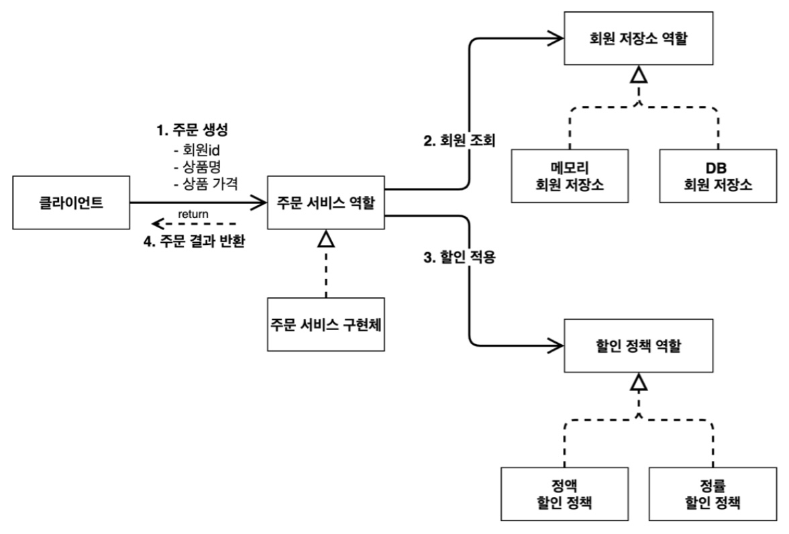

# 1.회원

- 회원을 가입하고 조회할 수 있다.
- 회원은 일반과 VIP 두 가지 등급이 있다.
- 회원 데이터는 자체 DB를 구축할 수 있고, 외부 시스템과 연동할 수 있다. (미확정)

 

# 2.주문과 할인 정책

- 회원은 상품을 주문할 수 있다.
- 회원 등급에 따라 할인 정책을 적용할 수 있다.
- 할인 정책은 모든 VIP는 1000원을 할인해주는 고정 금액 할인을 적용해달라. (나중에 변경 될 수 있 다.)
- 할인 정책은 변경 가능성이 높다. 회사의 기본 할인 정책을 아직 정하지 못했고, 오픈 직전까지 고민을 미루고 싶다. 최악의 경우 할인을 적용하지 않을 수 도 있다. (미확정)

 

# 3. 회원 요구사항의 분석

## a) 요구사항

> 1. 회원 : 요구사항과 등급을 인터페이스로 구현하면 될 것
> 2. 주문과 할인정책 :
>
> - 회원 등급에 따른 할인 정책
> - 할인 정책 자체가 적용이 안될 수 있음
>   > 중요한 부분은 미확정으로 된 부분이 있다는 것!  
>   > `인터페이스를 만들고, 구현체를 언제든지 갈아낄 수 있는 점`을 확인하기 위한 좋은 예제
>   > 스프링은 나중에 적용하고 지금은 완전 기본 타입만 적용한 상태, 구현도 vanilla JAVA로만 할 것임

 

## b) 구현 분석

### 1) 도메인 협력관계 그림 : DDD(Domain Driven Development)

- 기획자들도 볼 수 있는 것
- 이를 바탕으로 `클래스 다이어그램` 도식을 그림(개발자가)
    
  회원 저장소를 access하는 클래스의 구현체 세부 내용은 미정, 3중 1  
  자체 DB 및 외부 시스템 연동 등이 미확정이지만, 코딩을 안할 수는 없으므로,` 이런 상태에서 로컬에서 개발을 하다가 저장소가 선택이 되면 교체`하면 되는 시나리오 예상

### 2) 클래스 다이어그램

- 실제로 이대로 코딩하면 됨
- 인터페이스와 구현체가 모임
- 정적인 상태
  
  위의 구현 방식과 매칭되는 JAVA class를 실제 코딩하는 부분의 mapping
  interface + 구현체의 반복으로 코딩을 하여 만들 예정 - 외부 시스템은 일단 제외

### 3) 객체 다이어그램

- 실제 서버로 올라갈 때, 객체간에 관계를 도식
- 동적인 상태
- **`동적으로 결정되는 것을 구체적으로 결정한 것`** &nbsp;이  
   _**클래스 다이어그램**과 다른 점_
  
  실제 객체 class 간의 참조 순서를 그린 것
  서버가 떠서, 클라이언트 객체가 실제로 참조하는 주소값에 있는 인스턴스는 "회원서비스(MemberServiceIml)", 이는 다시 메모리 회원저장소 클래스를 바라보고 있음

 

# 4. 회원 도메인 설계의 문제점

- 이 코드의 설계상의 문제 : MemberServiceIml이 구현체 선택을 구현체로 선택하고 있음  
  즉 구현으로 의존(할당 부분이)  
  
- 즉, 이 상태에서는 MemberServiceIml이 Open Closed Principle이 지켜지지 않는 상태
- Dependency Inversion Principle도 역전, 구현체에 의존하게 되었음

 

# 5. 주문과 할인 도메인 설계

## a) 주문과 할인 정책

- 회원은 상품을 주문할 수 있다.
- 회원 등급에 따라 할인 정책을 적용할 수 있다.
- 할인 정책은 모든 VIP는 1000원을 할인해주는 고정 금액 할인을 적용해달라. (나중에 변경 될 수 있음)
- 할인 정책은 변경 가능성이 높다. 회사의 기본 할인 정책을 아직 정하지 못했고, 오픈 직전까지 고민을 미루고 싶다.  
  최악의 경우 할인을 적용하지 않을 수 도 있다. (미확정)

 

## b) 분석

### 1) 주문 도메인 분석

- 주문 생성시, 위에서 구현한 회원 조회를 통해 회원을 조회, 등급에 따른 할인 적용
- 과정
  1. 주문생성 : 주문 서비스에 주문 생성 요청
  2. 회원조회 : 할인을 위한 조회
  3. 할인적용 : 할인여부 판별 할인 정책에 위임
  4. 주문 결과 반환 : 할인을 적용한 주문 결과 반환
     ※ DB에다가 실제 주문 저장해야 되지만, 예제 연습을 위해 생략

### 2) 주문 클래스 다이어그램

- 마찬가지로 구현 역할 분리되었기 때문에, 구현체를 가져오는 클라이언트에서 구현체만 갈아끼우면 되는 상황  
  이미 알지만, DIP OCP 클라이언트 레벨에서는 지켜지지 않고 있음

### 3) 객체 다이어그램

pdf 참조!

- 객체를 나눠서 구현하는 회원 저장소 / 할인 정책을 도식화 하는 것
- 위에서 언급했지만, 이는 runtime, server에 올라갔을 때 동적인 도식표

 

# 5. 단위테스트 생성
