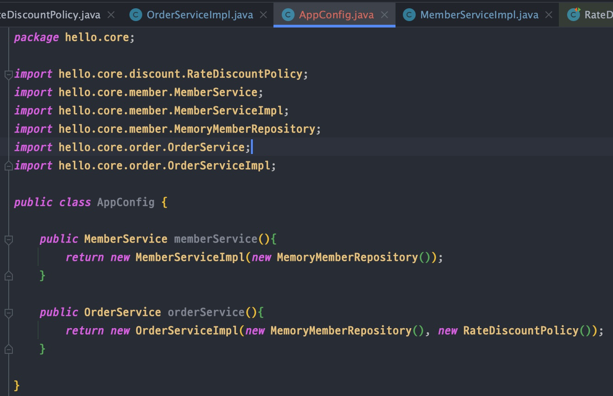
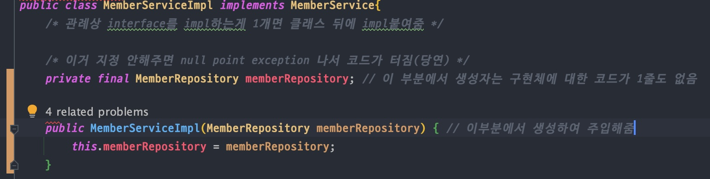

<link href="../md_config/style.css" rel="stylesheet">

# 관심사의 분리

## 1) 역할 배정?

- 어플리케이션을 하나의 공연에 대입해보자
- 각각의 인터페이스를 배역(배우의 role)이라고 하자 - 이때, 구현(실제 배우)과 역할(role)까지는 잘 분리되어있음
- 이때, 실제 배역에 맞는 배우를 선택하는 것은 누가 하는 것일까?
  - 특정 "역할"을 "구현"하는 구현체의 선택을 다른 곳에서 해주어야 함(역할의 분리)
  - 기존 코드는 **`구현체`** 로 역할을 몰아준 개념과 동일

## 2) 구현체 분리의 해결

- 생성자 주입 - injection
- OR 의존관계주입, 의존성 주입
- **`cmd + E`** 과거 사용한 것들 단축키로 보여줌

  > Apps Config : 어플리케이션의 전체 동작 방식을 구성하기 위해, *구현객체*를 생성하고 *연결*하는 책임을 가지는 별도의 클래스를 생성
  >
  > 1. 설정과 매우 유사
  > 2. 어플리케이션 구동의 전반을 책임지는 역할을
  > 3. JAVA에서 실제 동작에 필요한 구현 객체를 이부분에서 생성
  >    > AppConfig는 애플리케이션의 실제 동작에 필요한 구현 객체를 생성한다.  
  >    > ex) MemberServiceImpl, MemoryMemberRepository, OrderServiceImpl, FixDiscountPolicy  
  >    > AppConfig는 생성한 객체 인스턴스의 참조(레퍼런스)를 생성자를 통해서 주입(연결)해준다.  
  >    > ex) MemberServiceImpl, MemoryMemberRepository, OrderServiceImpl MemoryMemberRepository , FixDiscountPolicy
  > 4. Impl 입장에서 어떤 객체가 주입될지 모르고, 그 주입 대상은 app config에서 주입
  > 5. Impl은 오로지 실행에만 집중, 추상까지만 알고있기 때문에 이런식으로 구현할 수 있는 것

- Example

  

  

  - 구체적인 구현 클래스에 대해서 impl 단은 정보를 모르는 상태, 역할을 구현할 구현체를 select하는 곳은 다른 곳에서 한번에!
  - Final : 반드시 할당을 해주어야 함, null point exception
