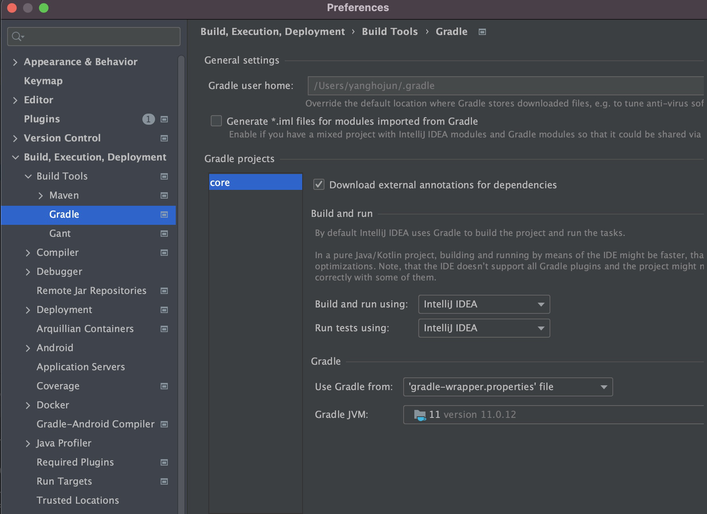

# 프로젝트 생성
1. 사전 준비물
   - Java 11 설치 : Oracle JDK 11  
     JDK 11 version 설치 : [link](https://deftkang.tistory.com/186)
   - IDE wnsql
   - 스프링부트 스타터 사이트로 가서 스프링 부트 프로젝트 생성  
    starter site : [link](https://start.spring.io)  
    스프링 부트로 configure만 하고 vanilla JAVA로 먼저 구현해볼 것임
   - 프로젝트 선택  
      - Project: Gradle Project Spring Boot: 2.3.x Language: Java Packaging: Jar
      - Java: 11 Project Metadata
      - groupId: hello
      - artifactId: core Dependencies: 선택하지 않는다.
   - Gradle 전체 설정
    

      ``` Gradle
        plugins {
            id 'org.springframework.boot' version '2.3.3.RELEASE'
            id 'io.spring.dependency-management' version '1.0.9.RELEASE'
            id 'java'
        }
        
        group = 'hello'
        version = '0.0.1-SNAPSHOT'
        sourceCompatibility = '11'
        
        repositories {
            mavenCentral()
        }

        dependencies {
            implementation 'org.springframework.boot:spring-boot-starter'
            testImplementation('org.springframework.boot:spring-boot-starter-test') {
                exclude group: 'org.junit.vintage', module: 'junit-vintage-engine'
            }
        }
        test {
            useJUnitPlatform()
        }
      ```