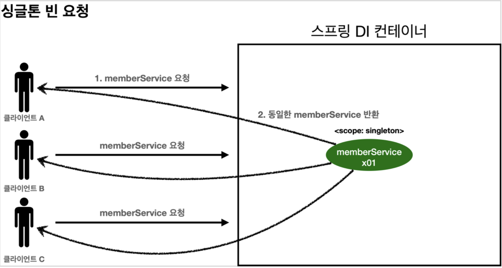
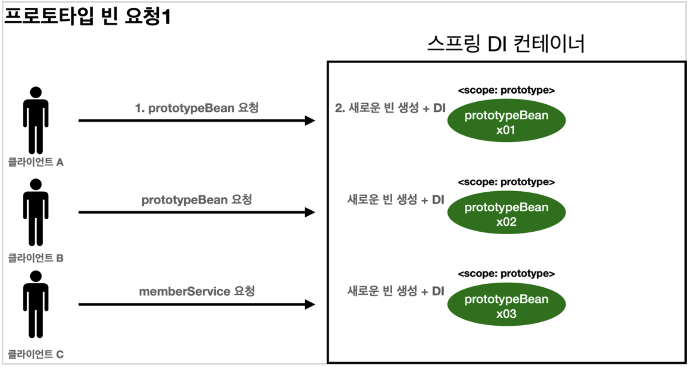
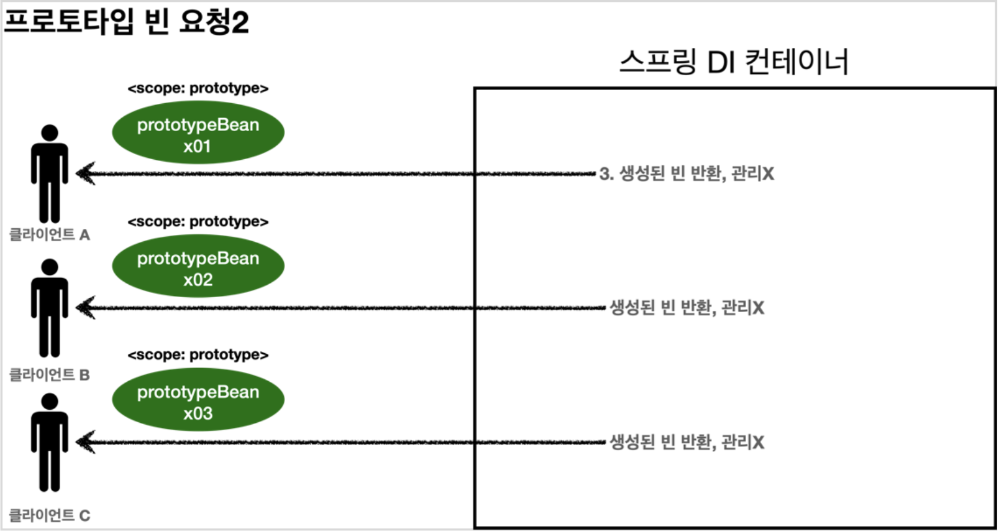

<link href="../md_config/style.css" rel="stylesheet">

# 프로토타입 스코프

## 1) 프로토타입 스코프와 싱글톤 스코프 차이

- **`스프링 컨테이너에서 조회 발생하면 새로운 객체 / 이미 존재하는 객체 돌려줌`**
- 싱글톤 스코프 : 항상 같은 인스턴스(객체)를 반환
  - 특징
    1. 항상 관리하던 싱글톤 스프링 빈을 반환
- 프로토타입 스코프 : 항상 새로운 인스턴스(객체)를 반환
  - 특징
    1. 관리 끝까지 안함
    2. 빈 조회시 새로운 인스턴스 반환
  - 과정
    1. 빈 요청(같이 혹은 순차적으로 클라이언트 요청)
    2. **`스프링이 이 시점에 컨테이너에 프로토타입 스코프 빈을 생성, 필요 의존관계 주입`** ; 컨테이너에 등록, DI 주입, 초기화 메서드까지 모두 이 시점에서 수행
    3. **`이후 스프링 컨테이너에서 삭제하고 관리하지 않음(반환(return)하고 관리하지 않는다는 의미)`** -> @preDestroy 등이 호출되지 않음, 클라이언트 단에서 종료시 수행해야 하는 작업들을 알아서 작성해주어야 함!
    4. 같은 요청이 오면 항상 새로운 빈을 생성하여 반환

## 2) 두 스코프 혼용의 문제점

- 다음장에서 살펴볼 것!
