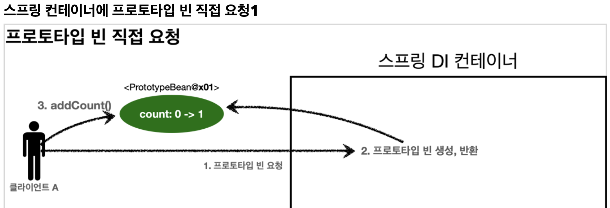
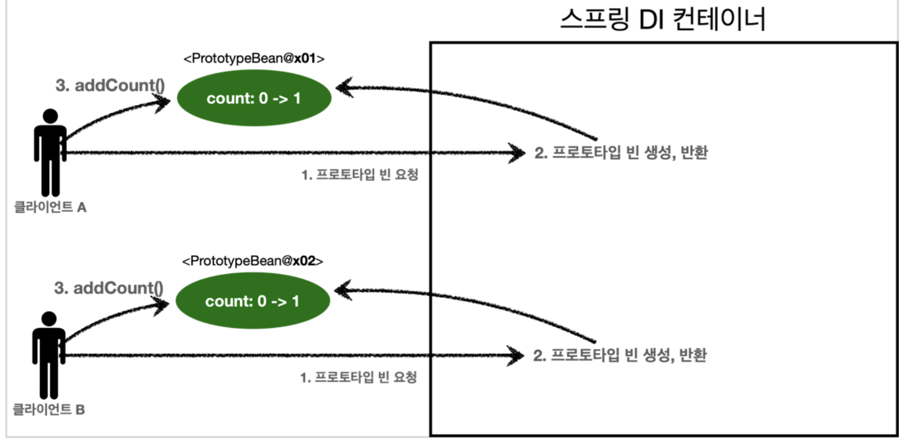
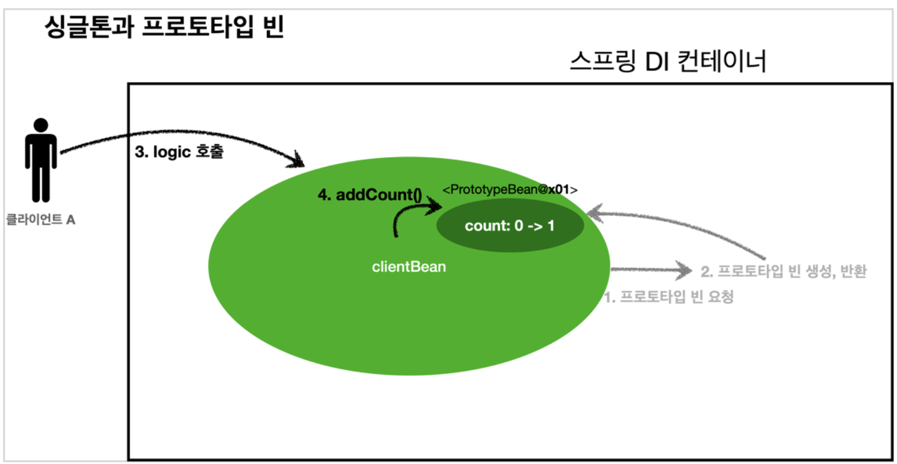

<link href="../md_config/style.css" rel="stylesheet">

# 프로토타입 스코프, 싱글톤 빈과 함께 사용시 문제점

## 1) 문제점



<br>



- 의도한 대로 잘 동작하지 않는다! 주의할 것!
- 동작과정
  1. 클라이언트 요청시 프로토타입 빈 요청
  2. 카운트 값이 클라이언트 별로 존재하게 되고, 메서드 호출시 클라이언트 별로 count 값을 올림

<br>



- 상황

  1. 클라이언트 빈은 PrototypeBean을 생성시점에 주입을 받고, 싱글톤이기때문에 언제라도 호출될 시, 같은 객체가 반환이 됨
  2. 이때, "클라이언트 빈"은 "프로토타입 빈"을 내부 필드에 참조값으로 가지고 있음(클라이언트에서 reference 들고 있어야 활용할 수 있으므로)
  3. 동적으로 모든 스프링 빈이 DI가 완료된 시점에서, 고객 A의 요청이 오면, "클라이언트 빈"의 .logic() 메서드가 호출된다고 가정
  4. "클라이언트 빈"의 .logic()은 "프로토타입 빈"의 .addCount()를 호출하여 count가 1로 올라감
  5. **`중요`**
     - 고객B가 새로 요청을 부를 때, 같은 "클라이언트 빈"이 호출이 되므로, 의도와는 다르게 그 객체 안의 "프로토타입 빈"은 과거에 주입이 이미 된 빈이다.
     - **`사용될 때마다 생성되는 것이 아니다!`**
  6. **`"프로토타입 빈"의 .addCount()를 호출하여 count가 2로 올라감`**

- 참조

  - 여러 빈에서 같은 프로토타입 빈을 주입받으면, "주입 받는 시저에 각각 새로운 프로토타입 빈이 생성" 된다!
  - 이는 다른 빈에서 요구할 때만, 스프링 컨테이너가 새로 만들어서 주입해주기 때문

- Example

  - JAVA

    ```JAVA

          @Test
          void singletonClientUsePrototype() {
              ApplicationContext ac = new AnnotationConfigApplicationContext(PrototypeBean.class, ClientBean.class);

              ClientBean clientBean1 = ac.getBean(ClientBean.class);
              int count1 = clientBean1.logic();
              Assertions.assertThat(count1).isEqualTo(1);

              ClientBean clientBean2 = ac.getBean(ClientBean.class);
              int count2 = clientBean2.logic();
              Assertions.assertThat(count2).isEqualTo(2);


          }

          @Scope("singleton")
          static class ClientBean {
              private final PrototypeBean prototypeBean;
              // 싱글톤으로 올라가면서 prototype을 Constructor 시점에 요구하고, 그때 prototype을 스프링 컨테이너가 생성해서 주입
              // 이후 불변(재 주입이 아니므로)

              @Autowired
              public ClientBean(PrototypeBean prototypeBean) {
                  this.prototypeBean = prototypeBean;
              }

              public int logic() {
                  this.prototypeBean.addCount();
                  return this.prototypeBean.getCount();
              }
          }


          @Scope("prototype")
          static class PrototypeBean {
              private int count = 0;

              public void addCount() {
                  count++;
              }

              public int getCount() {
                  return this.count;
              }

              @PostConstruct
              public void init() {
                  System.out.println("PrototypeBean.init" + this);

              }

              @PreDestroy
              public void destroy() {
                  System.out.println("PrototypeBean.destroy");
              }
          }
      }

    ```

- 해결하려면?
  - Provider 사용
