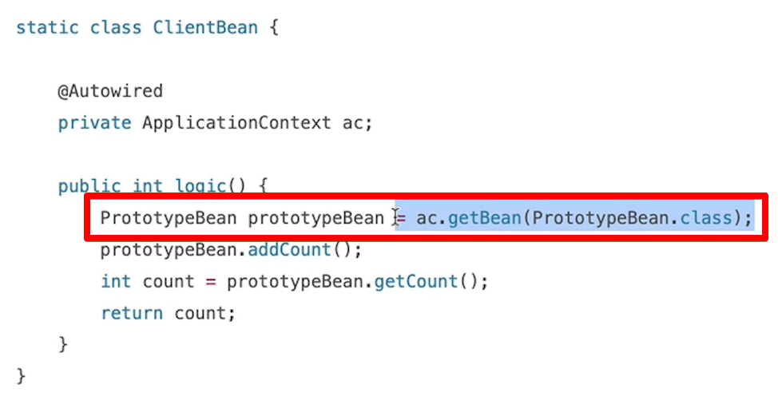
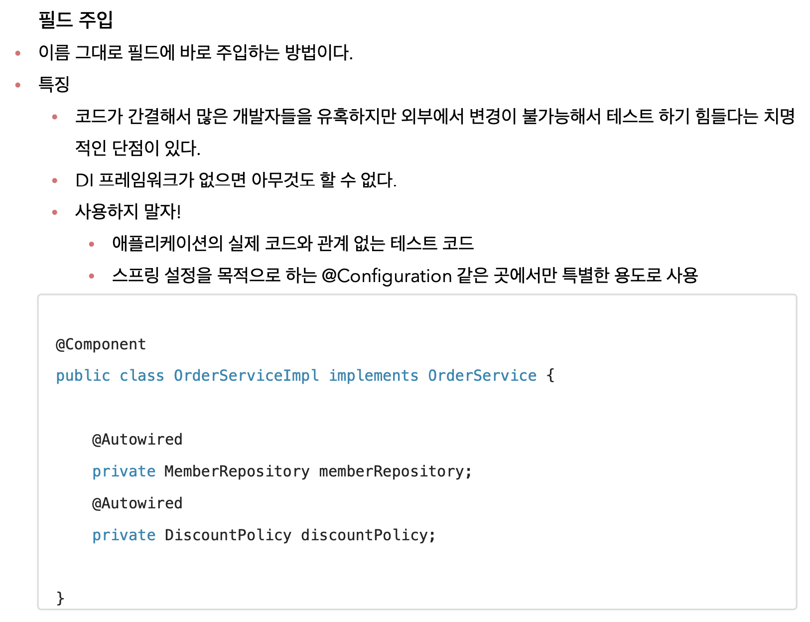
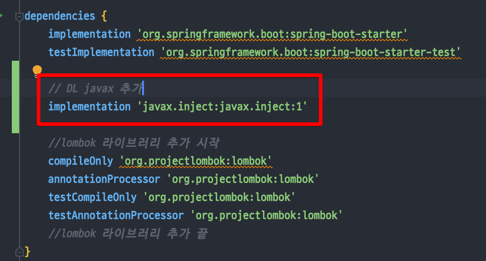
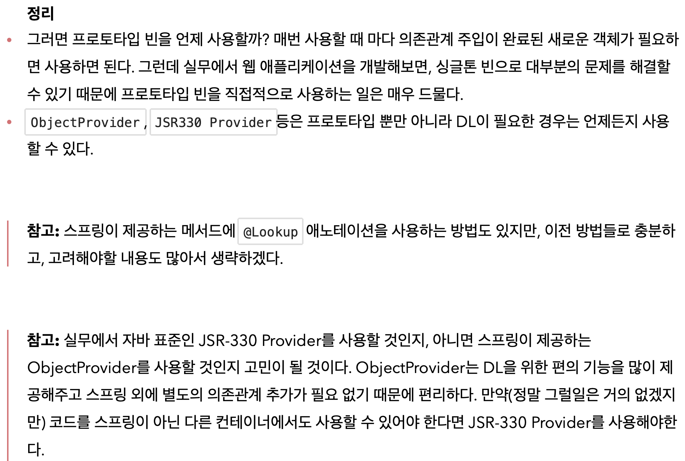

<link href="../md_config/style.css" rel="stylesheet">

# 프로토타입 스코프 매번 새로 신청하는 법(Provider)

## 1) 간단하고 무식한 방법



- 필드 주입하고, 매번 ac.getBean으로 조회해서 새로 가져오는 방식

  

- 간단하지만, Spring에 의존적인 코드 -> 비추
- 특징

  - 의존관계를 외부에서 주입(DI) 받는게 아니라 이렇게 직접 필요한 의존관계를 찾는 것을 Dependency Lookup (DL) 의존관계 조회(탐색)이라 함
    - **`OOP가 역할 / 구현일 때, DL은 연극에서 "극중 역할" : "배우" : "소품" 의 '소품'의 위치에 가깝다고 할 수 있음`**
  - 이렇게 스프링의 애플리케이션 컨텍스트 전체를 주입받게 되면, 스프링 컨테이너에 종속적인 코드가 되고, 단위 테스트도 어려워짐
  - 지금 필요한 기능은 지정한 프로토타입 빈을 컨테이너에서 대신 찾아주는 딱! DL 정도의 기능만 제공하는 무언가가 있으면 됨 -> **`ObjectProvider 사용!`**

## 2) ObjectProvider 사용

- 특징

  - ObjectProvider 는 스프링이 알아서 만들어서 주입해줌
  - 단위테스트 생성 및 mock 코드를 만들기 매우 쉬워지는 장점
  - 개별 특징
    1. ObjectFactory : 기능이 단순, 별도 라이브러리 필요 없음, 스프링에 의존
    2. ObjectProvider : ObjectFactory 상속, 추가 편이 기능들이 많음, 별도 라이브러리 필요 없음

- Example

  - JAVA

    ```JAVA
      // 필드 주입방식
      @Scope("singleton")
      static class ClientBean {

          @Autowired
          private ObjectProvider<PrototypeBean> prototypeBeanObjectProvider;

      //        @Autowired
      //        public ClientBean(PrototypeBean prototypeBean) {
      //            this.prototypeBean = prototypeBean;
      //        }

          public int logic() {
              PrototypeBean prototypeBean = prototypeBeanObjectProvider.getObject();
              prototypeBean.addCount();
              return prototypeBean.getCount();
          }
      }

      // 생성자 주입 방식
      @Scope("singleton")
      static class ClientBean {

          private final ObjectProvider<PrototypeBean> prototypeBeanObjectProvider;

          @Autowired
          public ClientBean(ObjectProvider<PrototypeBean> prototypeBeanObjectProvider) {
              this.prototypeBeanObjectProvider = prototypeBeanObjectProvider;
          }

          public int logic() {
              PrototypeBean prototypeBean = prototypeBeanObjectProvider.getObject();
              prototypeBean.addCount();
              return prototypeBean.getCount();
          }
      }
    ```

  - Result - Terminal

    ```TEXT
      // 다른 두개가 호출이 두번 되었음! 같은 클라이언트 빈이라도!
      PrototypeBean.inithello.core.scope.SingletonWithPrototypeTest1$PrototypeBean@1535444a
      PrototypeBean.inithello.core.scope.SingletonWithPrototypeTest1$PrototypeBean@273f5289

    ```

## 3) JSR-300 Provider



- javax.inject.Provider 자바 표준 라이브러리를 사용하는 것!
- Provider<T> 사용, get 메서드 사용
- Gradle에 해당 부분 추가하여 설치해야 함
- 자바 표준이고, 기능이 단순하므로 -> 단위테스트를 만들거나 mock 코드 만들기는 훨씬 쉬워짐!
- 별도 라이브러리가 필요, 자바 표준이므로 스프링 아닌 다른 컨테이너에서도 사용할 수 있음

- Example

  - JAVA

    ```JAVA
      @Scope("singleton")
      static class ClientBean {

          //private final ObjectProvider<PrototypeBean> prototypeBeanObjectProvider;
          private final Provider<PrototypeBean> prototypeBeanObjectProvider;

          @Autowired
          //public ClientBean(ObjectProvider<PrototypeBean> prototypeBeanObjectProvider) {
          public ClientBean(Provider<PrototypeBean> prototypeBeanObjectProvider) {
              this.prototypeBeanObjectProvider = prototypeBeanObjectProvider;
          }

          public int logic() {
              //PrototypeBean prototypeBean = prototypeBeanObjectProvider.getObject();
              PrototypeBean prototypeBean = prototypeBeanObjectProvider.get();
              prototypeBean.addCount();
              return prototypeBean.getCount();
          }
      }
    ```

  - Result - Terminal

    ```TEXT

    ```

## 4) 정리



- **`ObjectProvider / Provider 는 빈의 생성을 지연하는 것!`** -> 이를 통해 정상동작을 보장하는 것
- 지연해야 하는 이유는 scope에 의한 각 빈의 Life-Cycle의 차이 등이 있을 수 있음
- 등록 시점에, Life-cylce 차이 등
