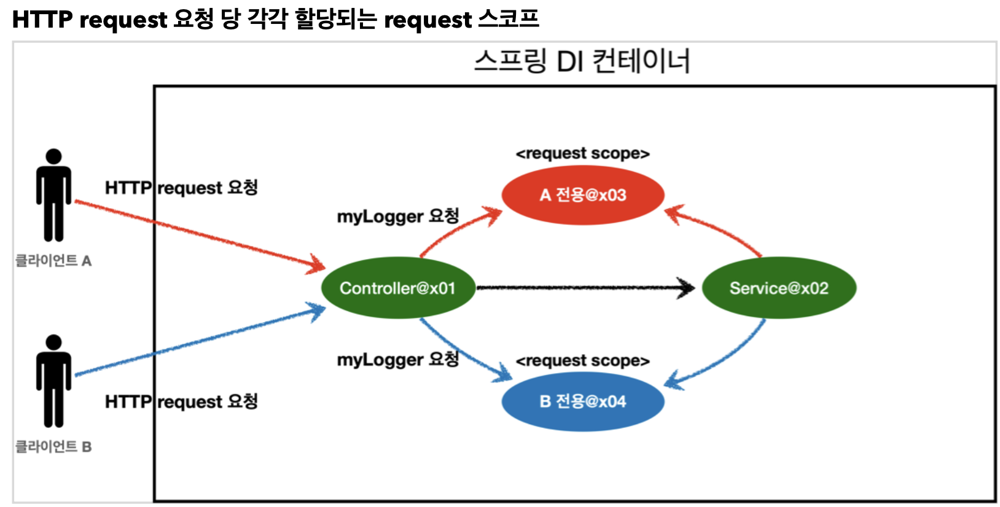
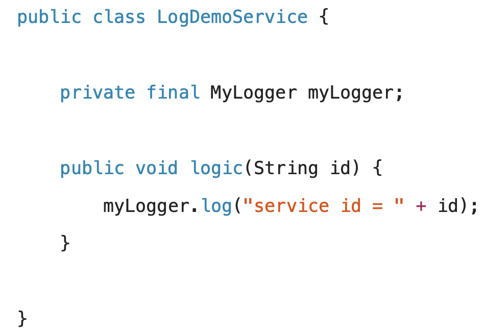
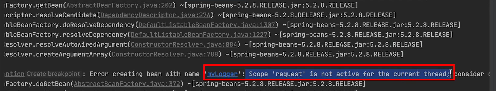

<link href="../md_config/style.css" rel="stylesheet">

# 웹 스코프

## 1) 웹 스코프 정의

- **`Request 가 들어오고, Response 를 보낼때까지의 life-cycle 이 "웹-스코프"`**
- 웹환경에서만 동작, 스프링이 스코프의 종료시점까지 관리, 종료될 때 preDestroy 호출

## 2) 웹 스코프 종류



- **`A, B 전용이 각각 생성되며(request web scope 예제), 빈 조회시 각 전용 request에 맞는 컨테이너가 반환된다(response 보내고 소멸되기 전까지)`**

**`여기서는 request 스코프를 예제로 설명!`**

- request: HTTP 요청 하나가 들어오고 나갈 때 까지 유지되는 스코프, 각각의 HTTP 요청마다 별도의 빈 인스턴스가 생성되고, 관리된다.
- session: HTTP Session과 동일한 생명주기를 가지는 스코프
- application: 서블릿 컨텍스트( ServletContext )와 동일한 생명주기를 가지는 스코프
- websocket: 웹 소켓과 동일한 생명주기를 가지는 스코프

<br>
<br>
<br>

---

# Request Scope 설정

- 다음과 같이 웹 라이브러리를 추가해주어야 함
  - Groovy
    ```Groovy
    //web 라이브러리 추가
    implementation 'org.springframework.boot:spring-boot-starter-web'
    ```

## 1) 참고 1

> 참고: spring-boot-starter-web 라이브러리를 추가하면 스프링 부트는 내장 톰켓 서버를 활용해서 웹 서버와 스프링을 함께 실행  
> 참고: 스프링 부트는 웹 라이브러리가 없으면 우리가 지금까지 학습한 AnnotationConfigApplicationContext 을 기반으로 애플리케이션을 구동한다.  
> 웹 라이브러리가 추가 되면 웹과 관련된 추가 설정과 환경들이 필요하므로 AnnotationConfigServletWebServerApplicationContext 를 기반으로 애플리케이션을 구동

## 2) 참고 2

> 참고 : 기본 포트인 8080 포트를 다른곳에서 사용중이어서 오류가 발생하면 포트를 변경해야 한다.  
> 9090 포트로 변경하려면 다음 설정을 추가  
> -> main/resources/application.properties  
> server.port=9090

<br>
<br>
<br>

---

# Request 예제 개발

- 웹 개발 중, request 별로 로그를 남기고 싶은 경우가 발생!
- 개발 예시

  - 요구사항

    1. 기대하는 공통 포멧: [UUID][requesturl] {message}
       - UUID : 유일식별자로 request별 구분
    2. UUID를 사용해서 HTTP 요청을 구분하자.
    3. requestURL 정보도 추가로 넣어서 어떤 URL을 요청해서 남은 로그인지 확인하자.

    ```TXT
      [d06b992f...] request scope bean create
      [d06b992f...][http://localhost:8080/log-demo] controller test
      [d06b992f...][http://localhost:8080/log-demo] service id = testId
      [d06b992f...] request scope bean close
    ```

## 1) 구현

- Logger

  - JAVA

    ```JAVA

      @Component
      @Scope(value = "request")
      public class MyLogger {

          private String uuid;
          private String requestURL;

          public void setRequestURL(String requestURL) {
              this.requestURL = requestURL;
          }

          public void log(StringBuffer message) {

              message.insert(0, "[" + uuid + "]" + "[" + requestURL + "]" + "[");
              System.out.println(message.toString());

          }

          @PostConstruct
          public void init() {
              String uuid = UUID.randomUUID().toString();
              System.out.println("uuid [" + uuid + "] request-scope Bean create: " + this);
          }

          @PreDestroy
          public void destroy() {
              System.out.println("uuid [" + uuid + "] request-scope Bean destroyed: " + this);

          }
      }

    ```

  - 특징
    1. 로그를 출력하기 위한 MyLogger 클래스이다.
    2. @Scope(value = "request") 를 사용해서 request 스코프로 지정했다.  
       -> 이제 이 빈은 HTTP 요청 당 하나씩 생성되고, HTTP 요청이 끝나는 시점에 소멸
    3. 이 빈이 생성되는 시점에 자동으로 @PostConstruct 초기화 메서드를 사용해서 uuid를 생성해서 저장해 둔다.  
       -> 이 빈은 HTTP 요청 당 하나씩 생성되므로, uuid를 저장해두면 다른 HTTP 요청과 구분할 수 있다.
    4. 이 빈이 소멸되는 시점에 @PreDestroy 를 사용해서 종료 메시지를 남긴다.
    5. requestURL 은 이 빈이 생성되는 시점에는 알 수 없으므로, 외부에서 setter로 입력 받는다.

<br>
<br>
<br>

- Controller

  - JAVA

    ```JAVA

        @Controller
        @RequiredArgsConstructor
        public class LogDemoController {

          private final LogDemoService logDemoService;
          private final Provider<MyLogger> myLoggerProvider;

          @RequestMapping("log-demo")
          @ResponseBody
          public String logDemo(HttpServletRequest request) {
              String requestURL = request.getRequestURL().toString();
              MyLogger myLogger = myLoggerProvider.get();

              myLogger.setRequestURL(requestURL);
              myLogger.log("controller test");
              logDemoService.logic("testID");

              return "OK";
          }
        }
    ```

- 특징
  1. 로거가 잘 작동하는지 확인하는 테스트용 컨트롤러다. 여기서 HttpServletRequest를 통해서 요청 URL을 받았다.
  2. requestURL 값 http://localhost:8080/log-demo
  3. 이렇게 받은 requestURL 값을 myLogger에 저장해둔다. myLogger는 HTTP 요청 당 각각 구분되므로 다른 HTTP 요청 때문에 값이 섞이는 걱정은 하지 않아도 된다.
  4. 컨트롤러에서 controller test라는 로그를 남긴다.
     > 참고: requestURL을 MyLogger에 저장하는 부분은 컨트롤러 보다는 공통 처리가 가능한 스프링 인터셉 터나 서블릿 필터 같은 곳을 활용하는 것이 좋다. 여기서는 예제를 단순화하고, 아직 스프링 인터셉터를 학습 하지 않은 분들을 위해서 컨트롤러를 사용했다. 스프링 웹에 익숙하다면 인터셉터를 사용해서 구현해보자.

<br>
<br>
<br>

- Service

  - JAVA

    ```JAVA
      @Service
      @RequiredArgsConstructor
      public class LogDemoService {

          private final Provider<MyLogger> myLoggerProvider;

          public void logic(String id) {
              MyLogger myLogger = myLoggerProvider.get();

              myLogger.log("service id = " + id);
          }

      }
    ```

- 서비스 계층 특징

  

  1. 여기서 중요한점이 있다. request scope를 사용하지 않고 파라미터로 이 모든 정보를 서비스 계층에 넘긴 다면, 파라미터가 많아서 지저분해진다.
  2. 더 문제는 requestURL 같은 웹과 관련된 정보가 웹과 관련없는 서비스 계층까지 넘어가게 된다.
  3. 웹과 관련된 부분은 컨트롤러까지만 사용해야 한다.
  4. 서비스 계층은 웹 기술에 종속되지 않고, 가급적 순수하게 유지하는 것이 유지보수 관점에서 좋다.
  5. request scope의 MyLogger 덕분에 이런 부분을 파라미터로 넘기지 않고, MyLogger의 멤버변수에 저장해서 코드와 계층을 깔끔하게 유지할 수 있다.

---

## 3) Provider 사용 이유



- Controller가 뜨면(외부 request에 의해), Scope가 request scope가 된다
- 이때, Http request scope 때, Provider로 MyLogger를 요청하기 때문에, 오류가 없이 Spring이 tomcat webserver 를 통해 시작될 수 있음
- **`스프링 컨테이너가 LogDemoController에서 뜨고, myLogger를 DI 하면, myLogger Scope이 request scope 이므로 에러가 나는 것...!`**
- 설명
  - ObjectProvider 덕분에 ObjectProvider.getObject() 를 호출하는 시점까지 request scope 빈의 생성을 지연할 수 있다.
  - ObjectProvider.getObject() 를 호출하시는 시점에는 HTTP 요청이 진행중이므로 request scope 빈의 생성이 정상 처리된다.
  - ObjectProvider.getObject() 를 LogDemoController , LogDemoService 에서 각각 한번씩 따로 호 출해도 같은 HTTP 요청이면 같은 스프링 빈이 반환된다!
    - 내가 직접 이걸 구분하려면 얼마나 힘들까 ᅲᅲ...
