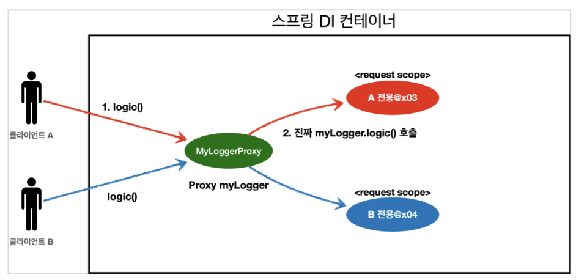

<link href="../md_config/style.css" rel="stylesheet">

# 스코프와 Proxy

- DL을 Provider 없이 그냥 적용할 방법이 없을까? 에 대한 구현방식

## 1) Syntax

- value, proxyMode 로 파라미터 값으로 전달해주어야 함; 변수가 2개 이상이기 때문에
  - 특징
    1. 적용 대상이 클래스이면 : TARGET_CLASS 선택
    2. 적용 대상이 인터페이스면 : INTERFACES 선택
  - 이렇게 하면 MyLogger 의 가짜 프록시 클래스를 만들어두고, HTTP request와 상관없이, **`가짜 프록시 클래스를 다른 빈에 미리 주입해둘 수 있음!`**
  - 동작방식
    - 실제 mylogger 가 아닌, 가짜 껍데기 Proxy를 넣어두고, 실제 호출될 때 진짜 원본을 가져오는 것
- Example

  - JAVA

    ```JAVA
      @Component
      //@Scope(value = "request")
      @Scope(value = "request", proxyMode = ScopedProxyMode.TARGET_CLASS) // 이부분을 변경!
      public class MyLogger {

          private String uuid;
          private String requestURL;

          public void setRequestURL(String requestURL) {
              this.requestURL = requestURL;
          }

          public void log(String message) {

              String tmpMessage = "[" + uuid + "]" + "[" + requestURL + "]" + "[" + message + "]";
              System.out.println(tmpMessage);

          }

          @PostConstruct
          public void init() {
              this.uuid = UUID.randomUUID().toString();
              System.out.println("uuid: [" + uuid + "] request-scope Bean create: " + this);
          }

          @PreDestroy
          public void destroy() {
              System.out.println("uuid: [" + uuid + "] request-scope Bean destroyed: " + this);

          }
      }

    ```

## 2) 결과

- 출력

  1. Java

     ```JAVA
       // 먼저 주입된 myLogger를 확인해보자.
       System.out.println("myLogger = " + myLogger.getClass());
     ```

  2. 출력결과
     - myLogger = class hello.core.common.MyLogger$$EnhancerBySpringCGLIB$$b68b726d



- 웹 스코프와 프록시 동작 원리

  - CGLIB라는 라이브러리로 내 클래스를 상속 받은 가짜 프록시 객체를 만들어서 주입한다.
  - **`이 프록시 객체는 진짜 MyLogger를 찾을 수 있는 방법이 있다`**
  - @Scope 의 proxyMode = ScopedProxyMode.TARGET_CLASS) 를 설정하면 스프링 컨테이너는 CGLIB 라는 바이트코드를 조작하는 라이브러리를 사용해서, MyLogger를 상속받은 가짜 프록시 객체를 생성한
    다.
  - 결과를 확인해보면 우리가 등록한 순수한 MyLogger 클래스가 아니라 MyLogger$ $EnhancerBySpringCGLIB 이라는 클래스로 만들어진 객체가 대신 등록된 것을 확인할 수 있다. 그리고 스프링 컨테이너에 "myLogger"라는 이름으로 진짜 대신에 이 가짜 프록시 객체를 등록한다.
  - ac.getBean("myLogger", MyLogger.class) 로 조회해도 프록시 객체가 조회되는 것을 확인할 수 있다. 그래서 의존관계 주입도 이 가짜 프록시 객체가 주입된다.

- 가짜 프록시 객체는 요청이 오면 그때 내부에서 진짜 빈을 요청하는 위임 로직이 들어있다.
  - 가짜 프록시 객체는 내부에 진짜 myLogger를 찾는 방법을 알고 있다.
  - 클라이언트가 myLogger.logic() 을 호출하면 사실은 가짜 프록시 객체의 메서드를 호출한 것이다. **`가짜 프록시 객체는 request 스코프의 진짜 myLogger.logic() 를 호출한다.`**
  - **`가짜 프록시 객체는 원본 클래스를 상속 받아서 만들어졌기 때문에 이 객체를 사용하는 클라이언트 입장에 서는 사실 원본인지 아닌지도 모르게, 동일하게 사용할 수 있다(다형성)`**
- 동작 정리
  - CGLIB라는 라이브러리로 내 클래스를 상속 받은 가짜 프록시 객체를 만들어서 주입한다.
  - 이 가짜 프록시 객체는 실제 요청이 오면 그때 내부에서 실제 빈을 요청하는 위임 로직이 들어있다.
  - **`가짜 프록시 객체는 실제 request scope와는 관계가 없다. 그냥 가짜이고, 내부에 단순한 위임 로직만 있고, 싱글톤 처럼 동작한다. -> 스코프에 제약받지 않는 dummy, 간단한 로직 수행 후 원본에게 넘겨줌`**
- 특징 정리
  - 프록시 객체 덕분에 클라이언트는 마치 싱글톤 빈을 사용하듯이 편리하게 request scope를 사용할 수 있다.
  - **`사실 Provider를 사용하든, 프록시를 사용하든 핵심 아이디어는 진짜 객체 조회를 꼭 필요한 시점까지 지연 처리 한다는 점이다.`** -> 진짜 httq request 스코프가 들어올 때 까지 버티는 것
  - 단지 애노테이션 설정 변경만으로 원본 객체를 프록시 객체로 대체할 수 있다. 이것이 바로 다형성과 DI 컨 테이너가 가진 큰 강점이다.
  - 꼭 웹 스코프가 아니어도 프록시는 사용할 수 있다.
- 주의점
  - 마치 싱글톤을 사용하는 것 같지만 다르게 동작하기 때문에 결국 주의해서 사용해야 한다. -> **`reuqest 마다 사실은 새로 생성되기 때문!`**
  - 이런 특별한 scope는 꼭 필요한 곳에만 최소화해서 사용하자, 무분별하게 사용하면 유지보수하기 어려워 진다.

## 3) 참조

- Chapter 8-8 의 AOP 참조
  - 위의 Proxy는 AOP 과정에서 많이 사용이 된다!
