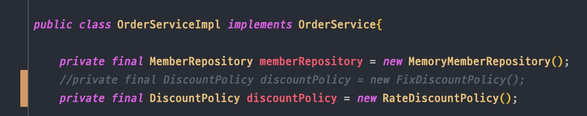
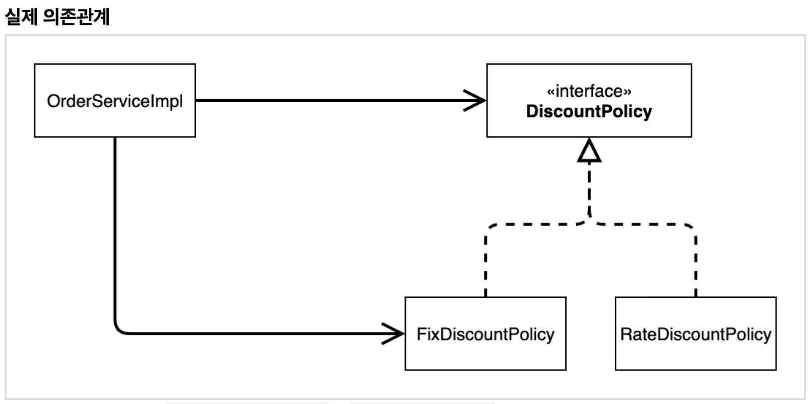
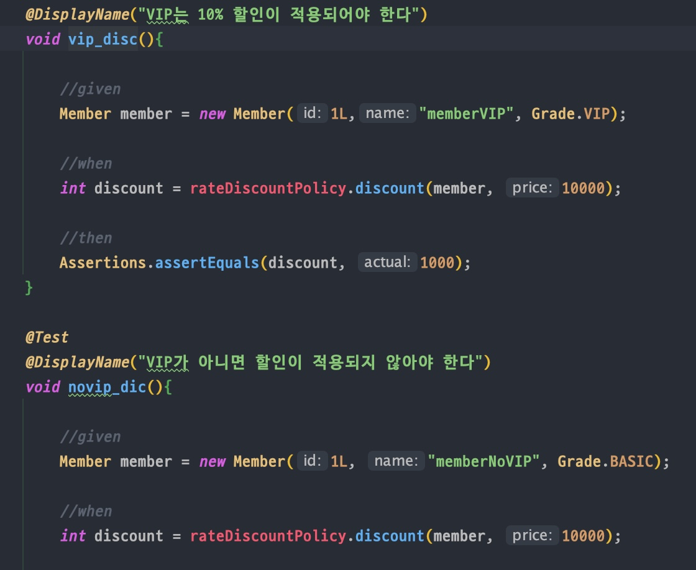

<style>
  img {
  max-width:800px;
  height:auto;
  }
</style>

# 객체지향 원리 적용

## 1) 목표

- 1강에서 사용했던 OOP partial 원리를 기획자의 변경된 요구에 맞추어서, 구현체를 변경할 때, OOP가 잘 지켜지는지, 또 그렇다면 그것이 얼마나 유용한지 알아보는 예제
- Service class에서도 OOP가 지켜지려면 Spring Container까지 도입을 해야 함

## 2) 악덕(?) 기획자

- 기획의 의도가 자주 바뀌는 것을 의미
- 만약 기획이 변경이 되었을 때, 즉 핵심 도메인 / 기획의 역할은 변경되지 않았지만  
  구현이 변경되어야 할 때, OOP 원칙을 잘 맞추어서 설계가 되었다면 큰 무리가 없이 변경을 적용할 수 있어야 함
- 구체적인 상황

  - 결국 고정 할인에서 정률 할인으로 변경!
    ```
    순진 개발자: 제가 처음부터 고정 금액 할인은 아니라고 했잖아요.
    악덕 기획자: 애자일 소프트웨어 개발 선언 몰라요? “계획을 따르기보다 변화에 대응하기를”
    순진 개발자: ... (하지만 난 유연한 설계가 가능하도록 객체지향 설계 원칙을 준수했지 후후)
    ```

## 3) 구현체 변경

```JAVA
  public class RateDiscountPolicy implements DiscountPolicy{

      private int discountRate = 10;

      @Override
      public int discount(Member member, int price) {

          if(member.getGrade() == Grade.VIP){
              return price * discountRate / 100; 이부분에서 그냥 나눗셈을 해주어도 가능(인터페이스에서는 int return값)
          } else{
              return 0;
          }

      }
  }

```

## 4) Service 에서 구현체 변경



- 구현체를 rate discount로 바꾸어 주었으나, Service 입장에서는 OOP를 적용하지 못한 객체지향 원리가 지켜지지 않은 변경사항임
- 지키지 않은 사항
  1. DIP : Dependency Inversion Principle
     - OrderServiceImpl이 DiscountPolicy에 의 존하며 interface에 의존하고 있으나  
       구현체 부분을 포함하고 있으므로 구현체에도 의존하고 있음 (구체(구현체)에 함께 의존하고 있음)
  2. OCP : Open Close Principle
     - 변경하지 않고 확장할 수 있어야 하나 지금의 구현 상태로는 기능확장시 원본 Service 코드에 영향을 주는데 이는 OCP를 위반
- 해결

  

  - 참조 : [link](https://korshika.tistory.com/177?category=979914)
  - 기능의 확장은 역할을 추가한 후, 메소드 오버라이딩을 통해 구현해야하고 코드 자체를 수정하는 것은 지양해야 함
    > <span style="color:red">인터페이스에만 의존하도록 관계를 변경하면 됨</span>  
    > <span style="color:red">누군가 DiscountPolicy 인터페이스의 구현 객체를 생성하고 주입해주어 함</span>

## Final) Test case 유의사항

- Test, Displayname 다음과 같이 사용
  ```JAVA
      @Test
      @DisplayName("VIP는 10% 할인이 적용되어야 한다")
      void vip_disc(){ ...
  ```
- 위의 테스트 케이스를 작성할 때, 구현체 메써드에 **`cmd + shift + t`** 로 테스트케이스 바로 작성 가능
- 모든 테스트 케이스가 **"경우의 수"**를 잘 포함해야 한다

  1. 멤버가 VIP / non VIP로 나누어서 작성

     

  2. static method 는 static import로 바꾸어서 활용하는게 JAVA 기본 문법  
     단축키 : **`Option + Enter`**
