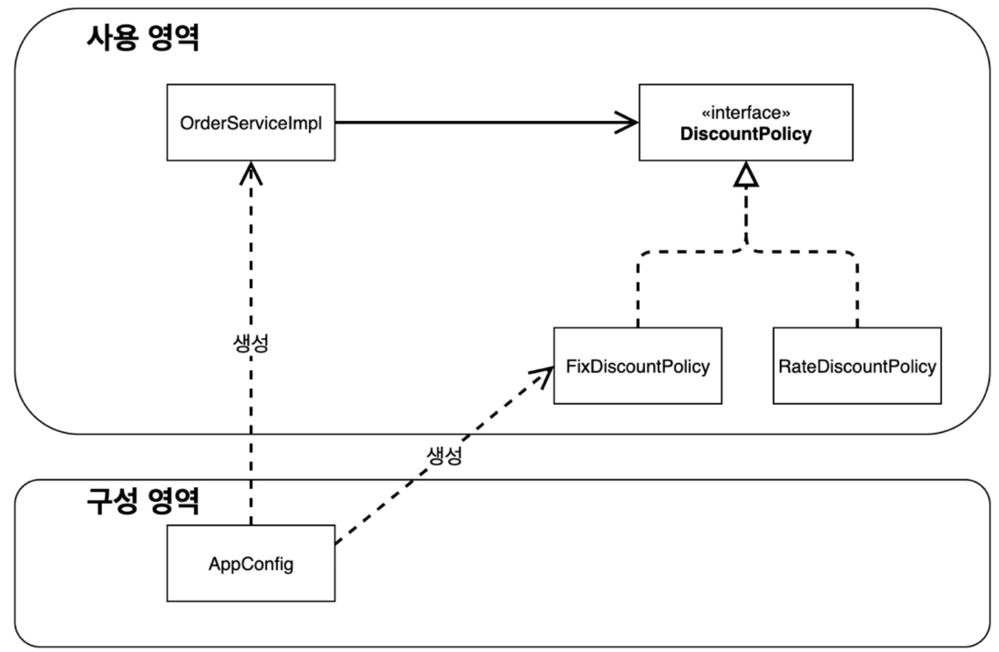
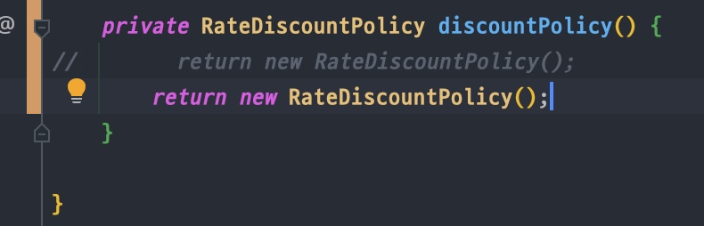

<link href="../md_config/style.css" rel="stylesheet">

# 새로운 할인정책 변경

## 1) App config 사용의 장점

- App config를 사용하므로써 다음의 변화

  1. **`사용영역`** + **`객체를 생성하고 구성하는 영역`**으로 분리되었음

  - 사용 영역과 구성 영역으로 변경되어, 사용영역의 코드를 하나도 손을 댈 필요가 없음!

    

  2. 실제 구현체를 구현하는 config 부분만 변경을 해주면, 잘 동작함  
     (OOP 설계를 잘 지켰기 때문에 쉽게 변경할 수 있음)

     - Test case all Green!

     

## 2) 결론

- DIP가 잘 지켜짐
- OCP가 잘 지켜짐
