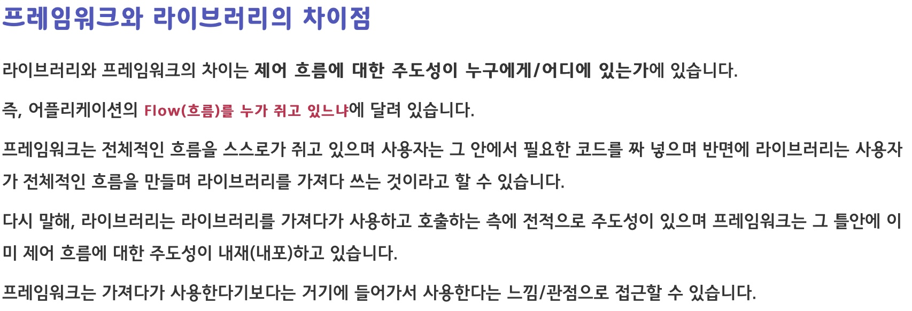
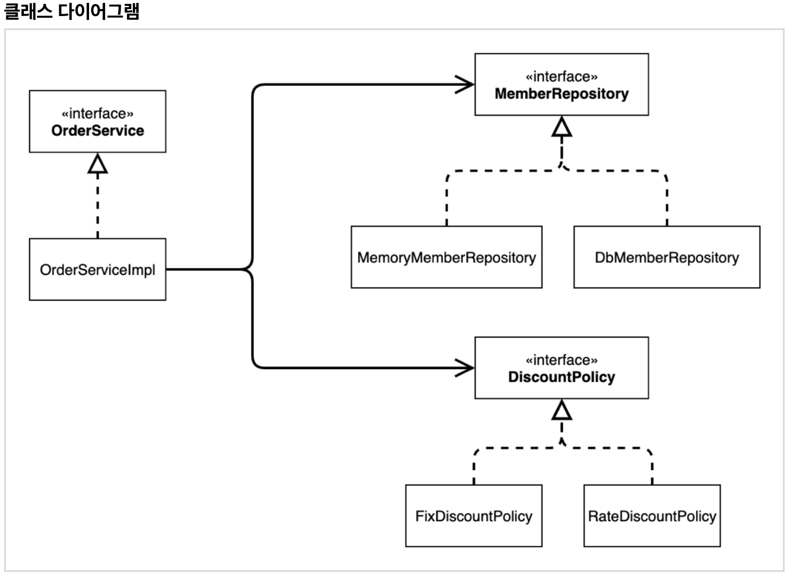
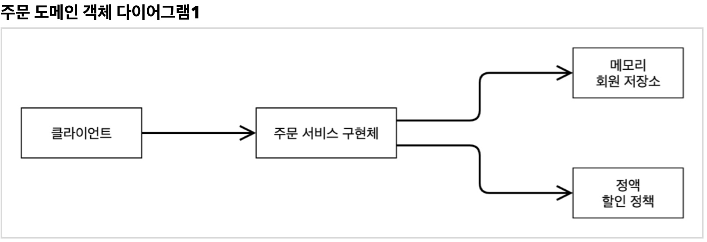

<link href="../md_config/style.css" rel="stylesheet">

# IoC, DI 그리고 컨테이너

- Inversion of Control & Dependency Injection

## 1) IoC(제어의 역전)

- 기존 프로그램은 클라이언트 객체가 구현 객체 생성, 연결, 실행까지 모두 담당
- AppConfig의 사용으로 구성 부분과 실행 부분을 분리할 수 있음
- XXX_ServiceImpl은 실행만을 담당하게 되고, 어떤 구현객체를 사용하는지에 대해서는 알지 못하고, 알 필요가 없음
  - 구성요소를 통한 제어가, 동적으로 실행되는 영역에 있는 것이 아니라, 외부에서 주입
    > Note : 외부 환경에서 주입하여 관리하는 것을 제어의 역전 Inversion of Control 이라고 함
    > 보통 프레임워크 / 라이브러리를 구분할 때 IoC를 기준으로 함

## 2) 프레임워크 VS 라이브러리

1. 프레임워크

   - 프레임워크가 내가 작성한 코드를 제어하고 대신 실행해주면 그것을 프레임워크(개발자가 코드에 맞추는 것)
   - 내가 작성한 코드가 직접 제어의 흐름을 담당하면 라이브러리임
   - Example
     - JUnit
       1. @BeforeEach : 매 test 이전 수행 될 함수
       2. @Test : 테스트할 함수를 가져다 놓는 부분
       3. 함수안의 코드를 수행하여 확인할 수 있도록 함
       - Junit 실행 시, 위의 컨텍스트를 프레임워크가 알아서 수행해줄 것을 알고 있음
       - Junit 라이프사이클 (beforeEach 이후 test 수행)을 콜백 형식으로 수행해줌
   - 참조 : [Link](https://webclub.tistory.com/458)  
     

   

   
추가 설명

   

   제어의 역전이란 어떠한 일을 하도록 만들어진 프레임워크에 제어의 권한을 넘김으로써 클라이언트 코드가 신경 써야 할 것을 줄이는 전략입니다.

   이것을 제어가 역전 되었다 라고 합니다. 일반적으로 라이브러리는 프로그래머가 작성하는 클라이언트 코드가 라이브러리의 메소드를 호출해서 사용하는 것을 의미 합니다.

   프레임워크를 규정하는 특성은 프레임워크의 메소드가 사용자의 코드를 호출 한다는데 있습니다.

   여기까지는 이해가 쉽지만, 의문이 생깁니다.

   대체 어떻게 프레임워크가 나의 메소드를 호출하는가에 대한 의문입니다.

   어떻게 하면 프레임워크가 나의 코드를 호출 할 수 있을까? 프레임워크는 내가 작성한 코드를 모르잖아!.

   **` 제어를 역전시키는 (프레임워크가 나의 코드를 호출 할 수 있게 하는) 가장 쉽게 생각할 수 있는 접근 방법은 프레임워크의 event, delegate 에 나의 메소드를 등록 시키는 것`** 입니다.

   전달되는 인자와 반환 형식만 일치 한다면, 프레임워크 코드는 내가 작성한 객체와 타입을 고려하지 않습니다.

   등록된 메소드만 감지하여 실행 invoke 하는 것입니다.

   **`다른 방법은 프레임워크에 정의 되어 있는 인터페이스 interface, 추상타입 abstract 을 나의 코드에서 구현, 상속 한후 프레임워크에 넘겨주는 것`** 입니다.

   프레임워크는 인터페이스와 추상을 알고 있으므로 내가 하고자 하는 일련의 작업을 처리할 수 있습니다.

   이는 객체를 프레임워크에 주입하는 것이고, 이를 의존을 주입 dependency injection 한다고 합니다

   > 즉, 이 개념에 의하면 interface, impl로 동작 코드들을 구현하고, 이를 실행하는 serviceImpl 클래스에 객체를 주입하는 것 자체가 프레임워크 화 될 수 있음을 의미!

   

   

 

1. 라이브러리
   - 어떤 기능이 필요할 때, 불러온 후 사용(개발자가 주도하고 있음)

## 3) 의존관계 주입

- 클래스 다이어그램  
  

- 객체 다이어그램  
  

- 의존관계 주입으로, Servie 역할/기능 들이 interface / 역할에만 의존하도록 변경되었음 (이전에는 구현체에도 의존)
- 즉, 인터페이스에만 의존하도록 되어있어서 어떤 구현 객체가 사용될지는 모름

 

- 특징

  - **`의존관계는 정적인 클래스 의존관계 / 실행시점에 결정되는 동적인 객체(인스턴스) 의존관계 둘을 분리해서 생각해야 함`** &nbsp;&nbsp;-> 이 말의 뜻은?
    > 배운 다이어그램 종류
    >
    > 1. 도메인 다이어그램(DDD)
    > 2. 클래스 다이어그램(Static) : 정적인 클래스 의존관계
    > 3. 객체 다이어그램(Dynamic-OnServer) : 실행 시점에 결정되는 동적인 객체(인스턴스) 의존관계 - 위 그림 예시
    >    ※ 위 다이어그램들이 이제는 코드와 1대1 매칭이 될 수 있음

  1. 정적인 클래스 의존 관계

     - import code만 보고도 의존관계를 쉽게 판단할 수 있음
     - 어플리케이션을 실행하지 않아도 분석가능

  2. 동적 객체 인스턴스 의존 관계

  - 실행 시점(런타임) 에 외부에서 실제 구현 객체 생성하고 클라이언트에 전달하여, 클라이언트와 서버의 의존관계가 연결되는 것을 "의존관계 주입"
  - 객체 인스턴스 생성 & 참조값 전달(call by reference in JAVA)
  - **`클래스 의존관계(1번의) 변경 없이, 동적 객체 인스턴스 의존관계를 쉽게 변경할 수 있음`**

## 4) IoC 컨테이너, DI 컨테이너

- Inversion of Control & Dependency Injection
- **`IoC의 형식을 가진 DI 컨테이너라고 명명`** : 최근에는 DI 컨테이너라고 많이 씀(or 어셈블러, 오브젝트 팩토리)
