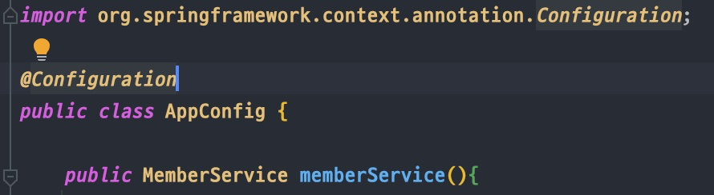
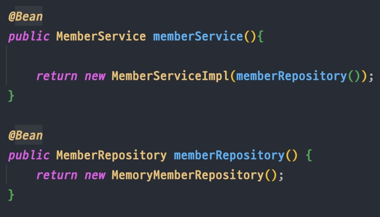

<link href="../md_config/style.css" rel="stylesheet">

# 스프링으로 전환

[ **`자바의 어노테이션은 이 링크를 참조할 것!`** ](https://honeyinfo7.tistory.com/56)

## 1) AppConfig 부분

1. App config 위에 configuration 어노테이션 추가

   - import org.springframework.context.annotation.Configuration; 으로 반드시 잘 import 된건지 확인
   - 이 @Configuration 은 이 클래스가 설정정보인 것을 알려주는 것(구성 정보를 담고있다)  
     

<br>

2. 각 매서드 위에 bean decorator 추가  
   

## 2) 실제 사용 부분

- 예시

  ```JAVA
  ...

  // ApplicationContext가 @Bean의 메서드들로 만들어지는 객체를 모두 관리해줌
  // 생성은 AnnotationConfigApplicationContext 를 구현체로 하여 만듦, parameter는 AppConfig클래스
  ApplicationContext applicationContext = new AnnotationConfigApplicationContext(AppConfig.class);
  // getBean으로 객체를 가져오는데, 관리는 객체 이름들로 되고, 선택도 이름으로 해야 함, 타입도 지정
  MemberService memberService = applicationContext.getBean("memberService", MemberService.class); // bean에서 가져올 때는 bean으로

  ...
  ```

  - 코드 주석 참조

- 다음과 같이 로그 출력 확인
  ```TEXT
  23:00:26.229 [main] DEBUG org.springframework.context.annotation.AnnotationConfigApplicationContext - Refreshing org.springframework.context.annotation.AnnotationConfigApplicationContext@77ec78b9
  23:00:26.265 [main] DEBUG org.springframework.beans.factory.support.DefaultListableBeanFactory - Creating shared instance of singleton bean 'org.springframework.context.annotation.internalConfigurationAnnotationProcessor'
  23:00:26.523 [main] DEBUG org.springframework.beans.factory.support.DefaultListableBeanFactory - Creating shared instance of singleton bean 'org.springframework.context.event.internalEventListenerProcessor'
  23:00:26.529 [main] DEBUG org.springframework.beans.factory.support.DefaultListableBeanFactory - Creating shared instance of singleton bean 'org.springframework.context.event.internalEventListenerFactory'
  23:00:26.532 [main] DEBUG org.springframework.beans.factory.support.DefaultListableBeanFactory - Creating shared instance of singleton bean 'org.springframework.context.annotation.internalAutowiredAnnotationProcessor'
  23:00:26.534 [main] DEBUG org.springframework.beans.factory.support.DefaultListableBeanFactory - Creating shared instance of singleton bean 'org.springframework.context.annotation.internalCommonAnnotationProcessor'
  23:00:26.540 [main] DEBUG org.springframework.beans.factory.support.DefaultListableBeanFactory - Creating shared instance of singleton bean 'appConfig'
  23:00:26.548 [main] DEBUG org.springframework.beans.factory.support.DefaultListableBeanFactory - Creating shared instance of singleton bean 'memberService'
  23:00:26.588 [main] DEBUG org.springframework.beans.factory.support.DefaultListableBeanFactory - Creating shared instance of singleton bean 'memberRepository'
  23:00:26.590 [main] DEBUG org.springframework.beans.factory.support.DefaultListableBeanFactory - Creating shared instance of singleton bean 'orderService'
  23:00:26.599 [main] DEBUG org.springframework.beans.factory.support.DefaultListableBeanFactory - Creating shared instance of singleton bean 'discountPolicy'
  ```
  - 처음에 Spring이 필요하여 등록하는 bean 로그가 나타남
  - 이후, 사용자가 등록해놓은(프레임워크화 된) 것들이 등록이 됨
  - 메서드 이름 = key, 객체 return 값 = value가 한쌍이 됨 => 이 전체가 컨테이너에 등록

## 3) 어떤 장점이?

- 지금 시점에는 공감이 안될 수도 있는데, 엄청난 장점이 있고, 관리가 매우 편한 것이 있음
