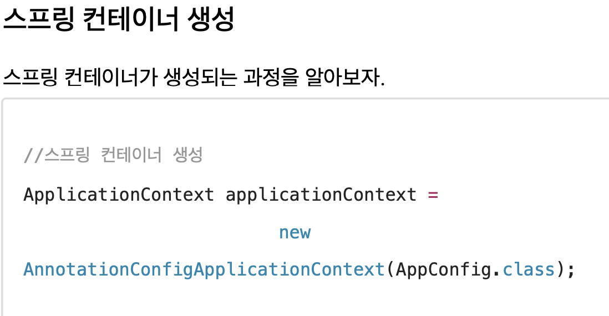
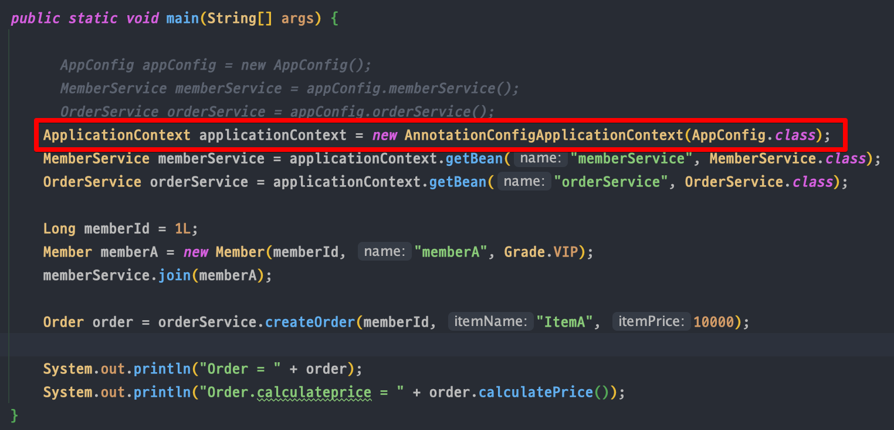
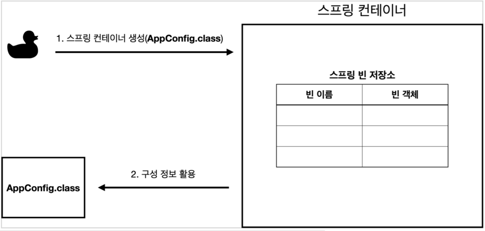
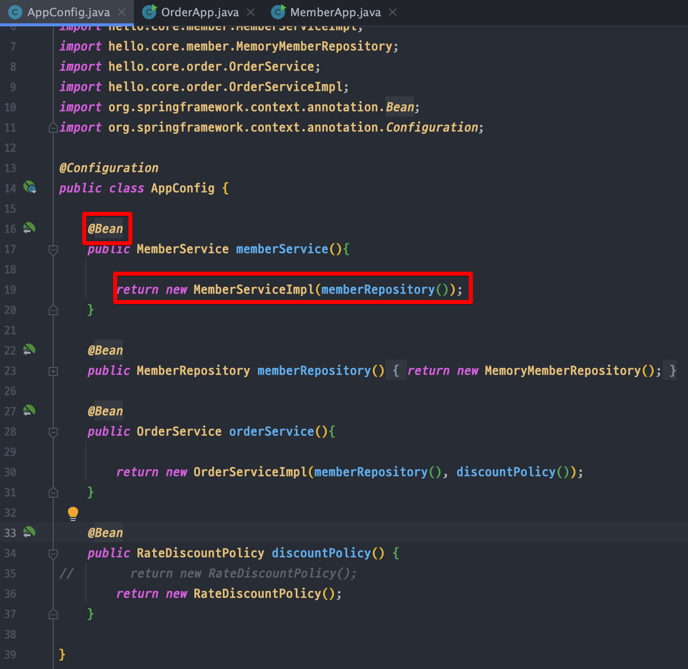
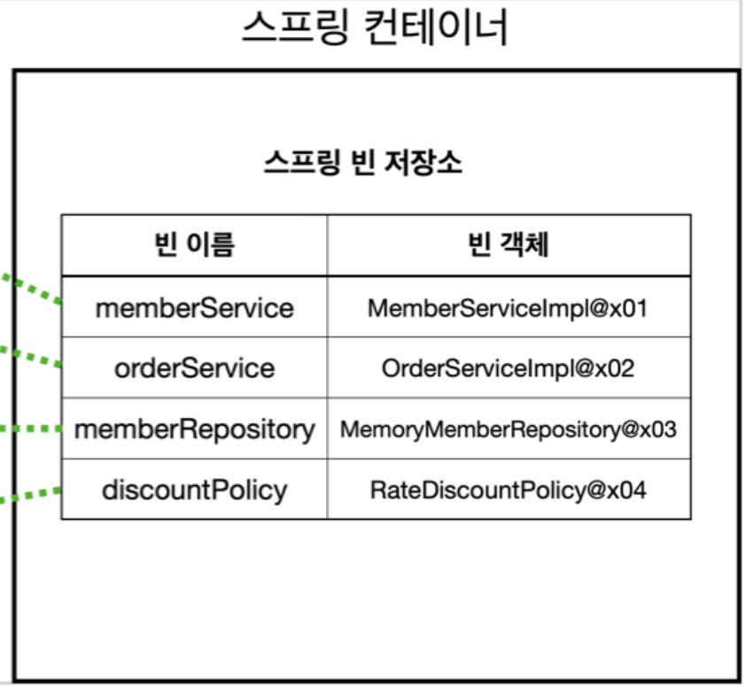
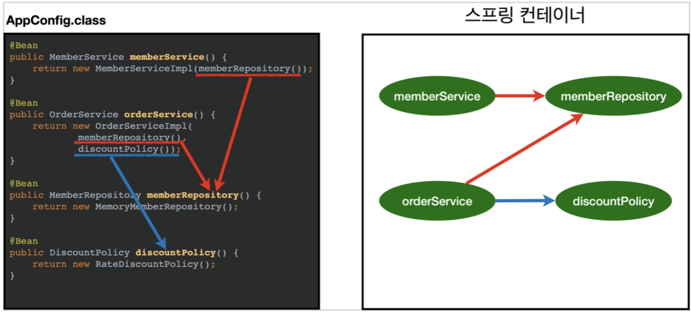

<link href="../md_config/style.css" rel="stylesheet">

# 스프링 컨테이너 생성

## 1) 스프링 컨테이너 생성방법

- ApplicationContext
  - ApplicationContext를 스프링 컨테이너라고 지칭
  - 인터페이스의 역할(+ API) : 내부 구조를 몰라도 어떻게 동작할지는 알고있고, output에 관심
  - XML 기반 / 자바의 annotation 기반 등으로 만들 수 있음
    - Annotation 기반 예시  
      
      - AnnotationConfigApplicationContext의 말뜻
        1. Annotation : Java의 어노테이션 기법
        2. (1)을 통한 configuration을 구성한다는 의미
        3. 인터페이스의 ApplicationContext를 뒤에 붙임

## 2) 생성과정

- new AnnotationConfigApplicationContext(AppConfig.class) 로 **`스프링 컨테이너를 생성`** 하여 사용
- 의미

  - AppConfig.class
    - 스프링 빈 저장소가 내부에 있음
    - 구성정보를 AppConfig.class로 파라미터로 정보를 넘기고, 하위 객체를 생성하여 key:value로 저장하도록 함
  - Bean

    
    

    - 위에서 제공된 AppConfig.class를 이용하여 각 bean들의 메서드를 이름을 이용하여 호출하고, return Bean 객체를 저장
    - Bean의 이름은 **`@Bean(name="memberService2)`** 등으로 교체할 수 있음, 단 이름끼리 중복되면 오류날 수 있으므로  
      default로 두는 것을 권장

## 3) 의존관계 설정

- 클래스 다이어그램 사용하여 도식했을 때 (위의 경우)
- 정적인 상태를 알 수 있음, 클래스 구성 정보를 한눈에 알 수 있음(구성과 실행[Service안의 코드들]의 분리)  
  어떠한 구현체를 선택하였고 돌려주는지 까지 확인 가능
- 스프링 컨테이너는 설정 정보를 참고해서 의존관계를 주입(DI)
- 단순 자바코드가 아닌, 싱글톤 컨테이너 등에 사용될 수 있는 등, 의존관계 설정을 매서드로 부르며(주입하며) 구현체를 선택하는 방식이 이점이 있음
  - 빈 생성 / 의존관계 주입의 구분
    - 뒷 강의의 **`의존관계 자동 주입`** 과 연관이 있음

