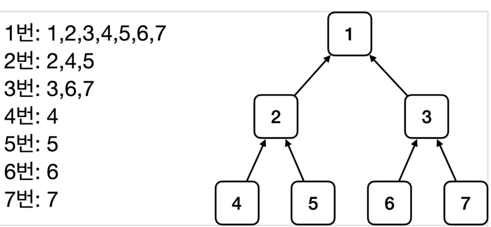

<link href="../md_config/style.css" rel="stylesheet">

# 상속관계와 조회

## 1) 자식 타입

- 부모 타입으로 조회하면, 자식 타입도 함께 조회 됨(자식들은 죄다 끌려나오게 되어있음)
- 자바 최고 부모 **`Object`** 타입으로 조회하면, 모든 Spring Bean을 조회하게 된다
- Example

  - 각 번호로 조회시, 조회되는 부모 / 상속 관계의 도식

      
