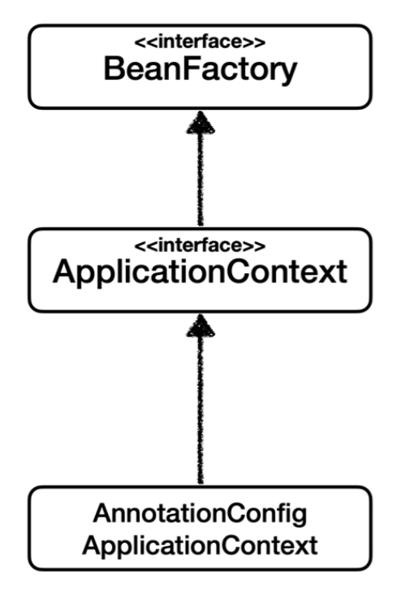
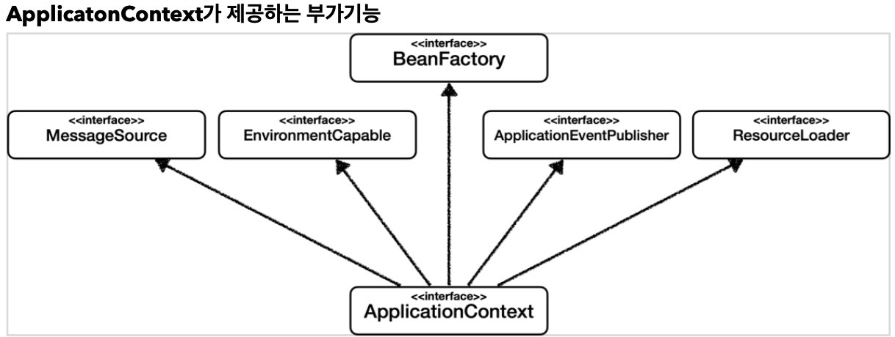
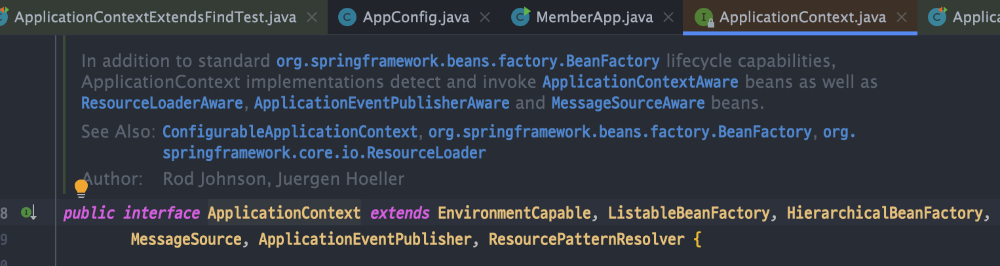

<link href="../md_config/style.css" rel="stylesheet">

# BeanFactory와 ApplicationContext

- 관계 도식

- 설명
  1. BeanFactory : 최상위 interface
  2. ApplicationContext : BeanFactory를 상속받는 interface, 즉 (1)에 부가기능이 추가되었다고 이해할 수 있음
  3. AnnotationConfig

## 1) BeanFactory

- 스프링 컨테이너의 최상위 인터페이스
- 스프링 빈을 관리하고 조회하는 역할을 담당
  - getBean, getBeansOfType ...
- **`getBean()`** 을 제공
- 지금까지 사용했던 대부분의 기능은 BeanFactory가 제공하는 기능

## 2) ApplicationContext

- BeanFactory의 기능을 모두 상속받아서 제공
- BeanFactory가 할 수 있는 기능들을 다 할 수 있음(상속받았으므로)

- 기능
  - 메시지소스를 활용한 국제화 기능  
    예를 들어서 한국에서 들어오면 한국어로, 영어권에서 들어오면 영어로 출력
  - 환경변수  
    로컬, 개발, 운영등을 구분해서 처리
  - 애플리케이션 이벤트  
    이벤트를 발행하고 구독하는 모델을 편리하게 지원
  - 편리한 리소스 조회  
    파일, 클래스패스, 외부 등에서 리소스를 편리하게 조회(추상화해서 조회하는 기능)

## 3) 정리

1. ApplicationContext는 BeanFactory의 기능을 상속 / BeanFactory는 일부분
2. ApplicationContext는 빈 관리기능 + 편리한 부가 기능을 제공
3. BeanFactory를 직접 사용할 일은 거의 없다. 부가기능이 포함된 ApplicationContext를 사용

- **`BeanFactory나 ApplicationContext를 스프링 컨테이너`** 라 한다.
