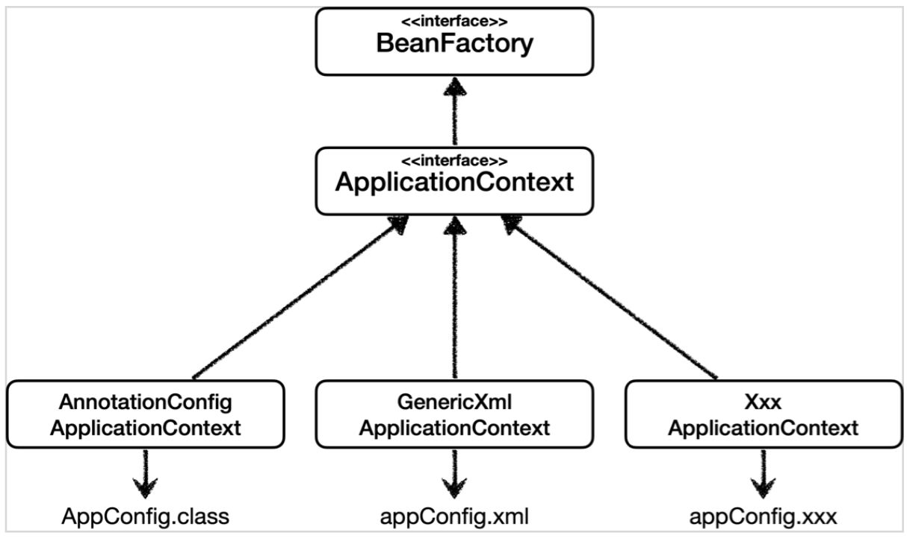
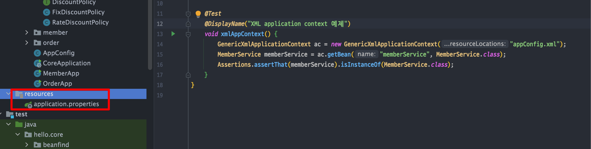
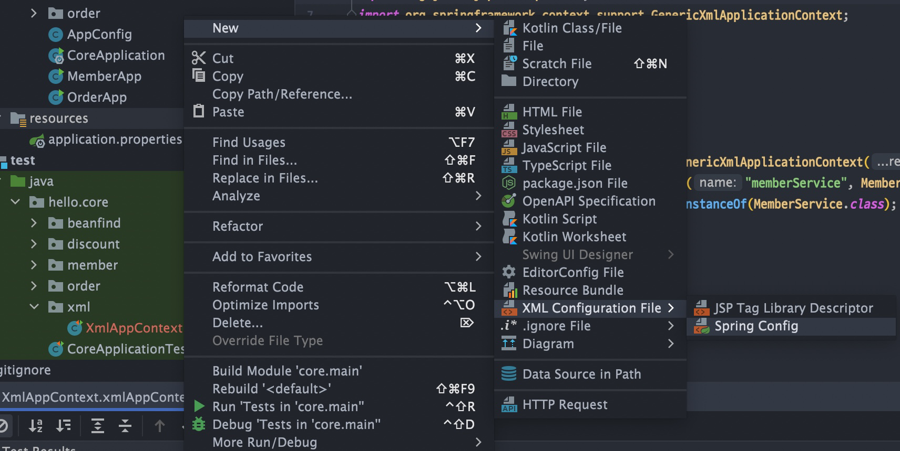

<link href="../md_config/style.css" rel="stylesheet">

# 다양한 설정

- Legacy를 이런식으로 설정한 곳도 있기 때문에 알면 좋음
- **`굉장히 유연한 Spring Bean! 이 장점을 알면 좋음`**

## 1) 설정 방식

- 자바코드, XML, Groovy

  - AppConfig라는 naming은 유지하는게 좋은 듯(이름 바꿔도 상관없는데 Spring Container로 주입할 때 이름 잘 따르면 될 듯)

    

<br>

- 각 방식

  1. 어노테이션 기반 - 지금까지 한 자바 방식의 configuration
  2. XML

     - 최근 스프링 부트를 많이 사용하면서 XML기반은 잘 사용하지 않음
     - 많은 레거시 프로젝트들이 사용하기는 하므로 알아두면 나쁘지는 않음
     - 빌드 없이 바로 적용이 될 수 있다는 점이 장점
     - 단 복잡해지면 한눈에 class별 정적 관계를 알아채기 어렵다는 단점이 있음
     - GenericXmlApplicationContext를 사용하면서 xml 파일을 넘기면 컨테이너를 불러올 수 있음
     - Example

       - JAVA
         ```JAVA
            public class XmlAppContext {
                  @Test
                  void xmlAppContext() {
                      ApplicationContext ac = new
              GenericXmlApplicationContext("appConfig.xml");
                      MemberService memberService = ac.getBean("memberService",
              MemberService.class);
                      assertThat(memberService).isInstanceOf(MemberService.class);
                  }
            }
         ```
       - AppConfig XML

         - 다음과 같이 resources 밑에 위치해야 함 (그러면 자동으로 읽을 수 있음)
             
           

         - appconfig xml

           ```XML
            <?xml version="1.0" encoding="UTF-8"?>
            <beans xmlns="http://www.springframework.org/schema/beans"
                  xmlns:xsi="http://www.w3.org/2001/XMLSchema-instance"
                  xsi:schemaLocation="http://www.springframework.org/schema/beans http://www.springframework.org/schema/beans/spring-beans.xsd">

                <bean id="memberService" class="hello.core.member.MemberServiceImpl" >
                    <constructor-arg name="memberRepository" ref="memberRepository" />
                </bean>

                <bean id="memberRepository" class="hello.core.member.MemoryMemberRepository"/>

                <bean id="orderService" class="hello.core.order.OrderServiceImpl">
                    <constructor-arg name="memberRepository" ref="memberRepository"/>
                    <constructor-arg name="discountPolicy" ref="discountPolicy"/>
                </bean>

                <bean id="discountPolicy" class="hello.core.discount.RateDiscountPolicy"/>

            </beans>
           ```
