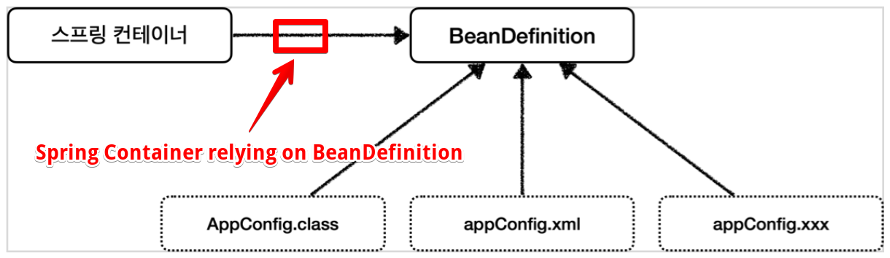

<link href="../md_config/style.css" rel="stylesheet">

# BeanDefinition

## 1) 추상화

- Spring Container로 빈을 가져올 때, Java / xml 모두 자유롭게 사용 가능
- 이것이 가능한 이유는 BeanDefinition이라는 역할의 추상화, 다시말해 이 역할에 대한 OOP가 잘 되어있는 것  
  **`BeanDefinition 자체가 인터페이스`**

<br>

- BeanDefinition을 "빈 설정 메타정보" 라고 함  
  이것은 @bean \<bean> 등에 의해 생성됨
- 스프링 컨테이너는 이 메타정보 BeanDefinition을 상용하여, 스프링 컨테이너 안의 스프링 빈을 생성함

  

> **`Note : BeanDefinition 메타 정보의 상세 항목은 다음과 같음; 이를 통해 bean을 생성`**  
> BeanClassName: 생성할 빈의 클래스 명(자바 설정 처럼 팩토리 역할의 빈을 사용하면 없음)  
> factoryBeanName: 팩토리 역할의 빈을 사용할 경우 이름, 예) appConfig  
> factoryMethodName: 빈을 생성할 팩토리 메서드 지정, 예) memberService  
> Scope: 싱글톤(기본값)  
> lazyInit: 스프링 컨테이너를 생성할 때 빈을 생성하는 것이 아니라, 실제 빈을 사용할 때 까지 최대한 생성을 지연처리 하는지 여부  
> InitMethodName: 빈을 생성하고, 의존관계를 적용한 뒤에 호출되는 초기화 메서드 명  
> DestroyMethodName: 빈의 생명주기가 끝나서 제거하기 직전에 호출되는 메서드 명  
> Constructor arguments, Properties: 의존관계 주입에서 사용한다. (자바 설정 처럼 팩토리 역할 의 빈을 사용하면 없음)

<br>

- Example

  - JAVA

    ```JAVA
      public class BeanDefinitionTest {

          AnnotationConfigApplicationContext ac = new AnnotationConfigApplicationContext(AppConfig.class);

          @Test
          @DisplayName("빈 설정 메타정보 확인")
          void findApplicationBean() {
              String[] beanDefinitionNames = ac.getBeanDefinitionNames();

              for (String beanDefinitionName : beanDefinitionNames) {
                  BeanDefinition beanDefinition = ac.getBeanDefinition(beanDefinitionName);

                  //Role ROLE_APPLICATION: 직접 등록한 애플리케이션 빈
                  //Role ROLE_INFRASTRUCTURE: 스프링이 내부에서 사용하는 빈
                  if (beanDefinition.getRole() == BeanDefinition.ROLE_APPLICATION) {
                      System.out.println("beanDefinitionName = " + beanDefinitionName);
                      System.out.println("beanDefinition = " + beanDefinition);}
              }
          }
      }
    ```

  - Result - Terminal
    - Bean lazyInit 은 사용 시점에 init 한다는 의미; 원래는 Spring Container에 등록 시점에 init되어야 함
    - Scope=; : Singleton으로 할당된 것, (~= 기본적으로 할당이 안된 것)
      ```TEXT
        beanDefinitionName = appConfig
        beanDefinition = Generic bean: class [hello.core.AppConfig$$EnhancerBySpringCGLIB$$1ccbcdc2]; scope=singleton; abstract=false; lazyInit=null; autowireMode=0; dependencyCheck=0; autowireCandidate=true; primary=false; factoryBeanName=null; factoryMethodName=null; initMethodName=null; destroyMethodName=null
        beanDefinitionName = memberService
        beanDefinition = Root bean: class [null]; scope=; abstract=false; lazyInit=null; autowireMode=3; dependencyCheck=0; autowireCandidate=true; primary=false; factoryBeanName=appConfig; factoryMethodName=memberService; initMethodName=null; destroyMethodName=(inferred); defined in hello.core.AppConfig
        beanDefinitionName = memberRepository
        beanDefinition = Root bean: class [null]; scope=; abstract=false; lazyInit=null; autowireMode=3; dependencyCheck=0; autowireCandidate=true; primary=false; factoryBeanName=appConfig; factoryMethodName=memberRepository; initMethodName=null; destroyMethodName=(inferred); defined in hello.core.AppConfig
        beanDefinitionName = orderService
        beanDefinition = Root bean: class [null]; scope=; abstract=false; lazyInit=null; autowireMode=3; dependencyCheck=0; autowireCandidate=true; primary=false; factoryBeanName=appConfig; factoryMethodName=orderService; initMethodName=null; destroyMethodName=(inferred); defined in hello.core.AppConfig
        beanDefinitionName = discountPolicy
        beanDefinition = Root bean: class [null]; scope=; abstract=false; lazyInit=null; autowireMode=3; dependencyCheck=0; autowireCandidate=true; primary=false; factoryBeanName=appConfig; factoryMethodName=discountPolicy; initMethodName=null; destroyMethodName=(inferred); defined in hello.core.AppConfig
        BUILD SUCCESSFUL in 17s
      ```

## 2) BeanDefinition 생성
- 이것을 만들기 위해 reader용 implement가 다 존재함
- 너무 자세히 알필요는 없고, BeanDefinition을 만들어주기 위한 Java / Xml 등 각각에 맞춘 reader 가 있음
- 코드 / Xml 을 말 그대로 parsing하여 메타 정보 BeanDefinition을 생성