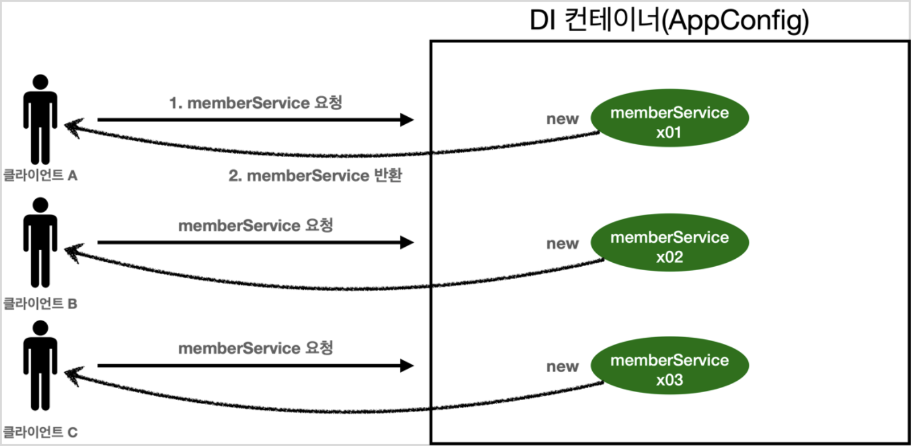

<link href="../md_config/style.css" rel="stylesheet">

# 싱글톤 패턴

- 객체가 런타임 Java JVM 안에 객체가 1개만 존재해야하는 경우에 싱글톤 패턴을 사용
- 웹쪽에서 왜 사용이 되는지에 대서 알아볼 예정

## 1) 웹 애플리케이션과 싱글톤

- 스프링은 태생이 기업용 온라인 서비스 기술을 지원하기 위해 탄생
- 대부분의 스프링 애플리케이션은 웹 애플리케이션 -> 보통 여러 고객이 동시 요청

  - 다음과 같이 객체를 매번 생성하는 경우 3개가 생성이 됨, 비효율 적인 방식
    

- Example

  - JAVA

    ```JAVA
      @Test
      @DisplayName("스프링 없는 순수한 DI 컨테이너")
      void pureContainer() {
          AppConfig appConfig = new AppConfig();

          // 1. 조회 : 호출할 때마다 객체를 생성
          MemberService memberService1 = appConfig.memberService();

          // 2. 조회 : 호출할 때마다 객체를 생성
          MemberService memberService2 = appConfig.memberService();

          // 참조값이 다름을 확인
          System.out.println("memberService1 = " + memberService1);
          System.out.println("memberService2 = " + memberService2);
      }
    ```

  - Result - Terminal
    ```TEXT
      memberService1 = hello.core.member.MemberServiceImpl@59da5855
      memberService2 = hello.core.member.MemberServiceImpl@6fd5a161
    ```
  - 웹 어플리케이션 입장에서 이런 방식은 비효율적임, 몇 만개씩 만들어야 될 수도 있음
    - 우리가 만들었던 스프링 없는 순수한 DI 컨테이너인 AppConfig는 요청을 할 때 마다 객체를 새로 생성
    - 고객 트래픽이 초당 100이 나오면 초당 100개 객체가 생성되고 소멸 : 해결방안은 해당 객체가 딱 1개만 생성되고, 공유하도록 설계(싱글톤 패턴)

