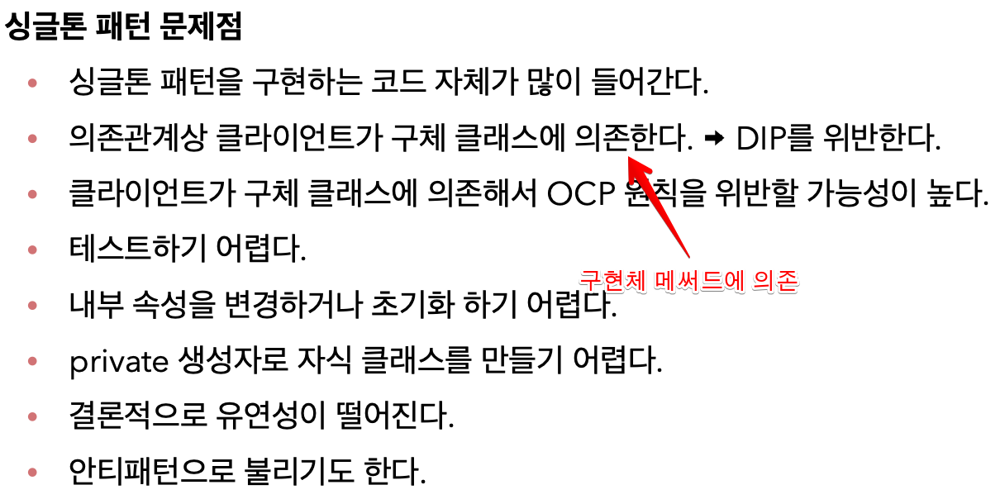

<link href="../md_config/style.css" rel="stylesheet">

# Singleton 방식

- 객체를 하나만 생성하도록 막으면 됨

## 1) 방식

- Java Singleton 참조
  - [참조1](https://webdevtechblog.com/싱글턴-패턴-singleton-pattern-db75ed29c36)
  - [참조2](https://elfinlas.github.io/2019/09/23/java-singleton/)
- 현재 예제는 Eager-Initializer
- private 키워드로 new 생성자 방식을 막아줌
- Spring Bean을 사용하면 기본적으로 singleton으로 생성해줌(웹 애플리케이션을 위해 개발된 프레임워크)

<br>

- Example

  - JAVA

    ```JAVA
      public class SingletonService {

          // 자기 자신을 내부에 private으로 static하게 가지고있음
          // 관례상 밑에처럼 작성
          // 클래스 level에 올라가기 때문에 단 하나만 존재하게 됨; 자바 기본의 Static에 대해서 공부해볼 것
          private static final SingletonService instance = new SingletonService();

          public static SingletonService getInstance() {
              return instance;
          }

          private SingletonService() {

          }

          public void logic(){
              System.out.println("싱글톤 객체 로직 호출");
          }

      }
    ```

## 2) 문제점


