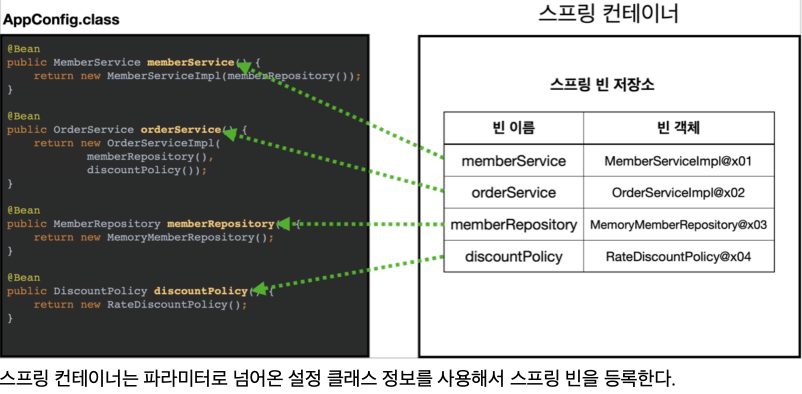
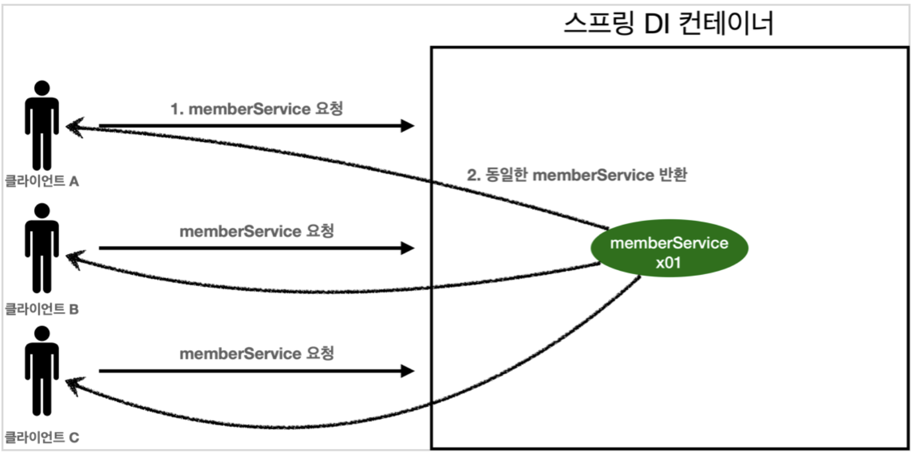

<link href="../md_config/style.css" rel="stylesheet">

# 싱글톤 컨테이너

- 싱글톤 패턴에서 살펴보았듯, 싱글톤 패턴 적용시 안티패턴의 문제가 있음
- 스프링 컨테이너 / 빈 은 다음과 같이 동작

  

  <br>

  

- 몇번을 조회하던, 기본적으로 스프링에서는 빈에서 관리되는 객체를 돌려주므로, 싱글톤 동작을 하게 되어있음
- **`지저분한 추가 코드가 없음, 구체에 의존하는 코드 부분이 없어져, OCP / DIP 등이 지켜짐, 테스트 코드 작성이 쉬워짐 등의 장점이 있음`**
- Spring에서 꺼내서 쓰기 때문에, 싱글톤을 구현하기위해 실행부에서 new나 주입해주는 부분에서 주입때 new 키워드를 쓰지 않아도 됨  
  -> 즉 실행부에 싱글톤의 지저분한 코드가 하나도 포함되지 않아도 되는것
- 원한다면 Bean Scope를 조절하여 싱글톤 컨테이너 방식 말고도 새로운 객체를 매번 생성하여 반환할 수 있음
- Example

  - JAVA

    ```JAVA
      @Test
      @DisplayName("스프링의 싱글톤 패턴 객체 사용")
      void springBeanSingletonContainer() {
    //        AppConfig appConfig = new AppConfig();
          ApplicationContext ac = new AnnotationConfigApplicationContext(AppConfig.class);

          // 1. 조회 : 호출할 때마다 객체를 생성
    //        MemberService memberService1 = appConfig.memberService();
          MemberService memberService1 = ac.getBean("memberService", MemberService.class);

          // 2. 조회 : 호출할 때마다 객체를 생성
    //        MemberService memberService2 = appConfig.memberService();
          MemberService memberService2 = ac.getBean("memberService", MemberService.class);

          // 참조값이 다름을 확인
          System.out.println("memberService1 = " + memberService1);
          System.out.println("memberService2 = " + memberService2);

          Assertions.assertThat(memberService1).isSameAs(memberService2);
      }
    ```

  - Result - Terminal
    - 같은 결과가 나옴!
    ```TEXT
      memberService1 = hello.core.member.MemberServiceImpl@53145d6a
      memberService2 = hello.core.member.MemberServiceImpl@53145d6a
    ```
