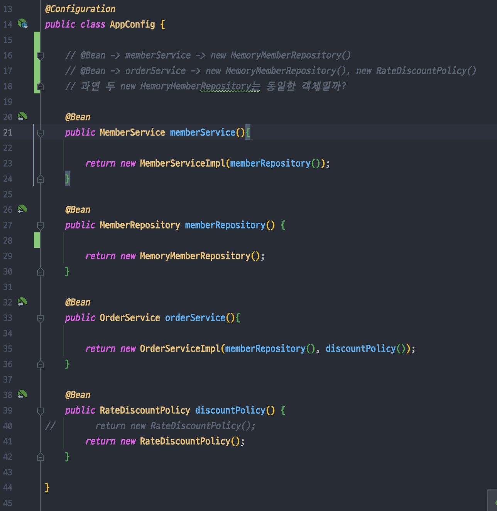
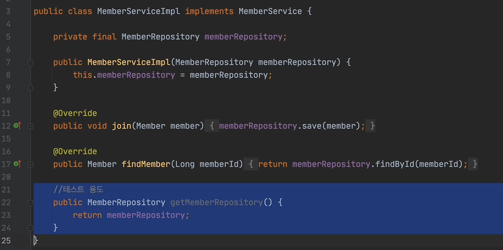

<link href="../md_config/style.css" rel="stylesheet">

# Configuration 심화(싱글톤)

- 원래는 싱글톤을 위해서 존재
- AppConfig에 적인 부분들은 기본적으로는 Context 작성하여 Spring이 읽어들이는 부분으로써 활용됨 + Java base 코드

## 1) Sprint Bean 동작에 대한 궁금증과 검증

- 다음의 부분이 어떻게 동작할까?

<br>



<br>

> Note: 이것도 싱글톤일까?  
> @Bean -> memberService -> new MemoryMemberRepository()  
> @Bean -> orderService -> new MemoryMemberRepository(), new RateDiscountPolicy()  
> 과연 두 new MemoryMemberRepository는 동일한 객체일까?

- 테스트 작성(inline으로)

<br>



<br>

- 결론 : 다 동일한 객체를 받음
- 이렇게 동작하는 이유
- Example

  - JAVA

    ```JAVA
      public class ConfigurationSingletonTest {

          @Test
          void configurationTest() {
              ApplicationContext ac = new AnnotationConfigApplicationContext(AppConfig.class);

              MemberServiceImpl memberService = ac.getBean("memberService", MemberServiceImpl.class);
              OrderServiceImpl orderService = ac.getBean("orderService", OrderServiceImpl.class);
              MemberRepository memberRepository = ac.getBean("memberRepository", MemberRepository.class);

              MemberRepository memberRepository1 = memberService.getMemberRepository();
              MemberRepository memberRepository2 = orderService.getMemberRepository();

              System.out.println("memberService : memberRepository1 = " + memberRepository1);
              System.out.println("orderService : memberRepository2 = " + memberRepository2);
              System.out.println("memberRepository = " + memberRepository);

          }

      }
    ```

  - Result - Terminal
    ```TEXT
      memberService : memberRepository1 = hello.core.member.MemoryMemberRepository@62c100be
      orderService : memberRepository2 = hello.core.member.MemoryMemberRepository@62c100be
      memberRepository = hello.core.member.MemoryMemberRepository@62c100be
    ```
