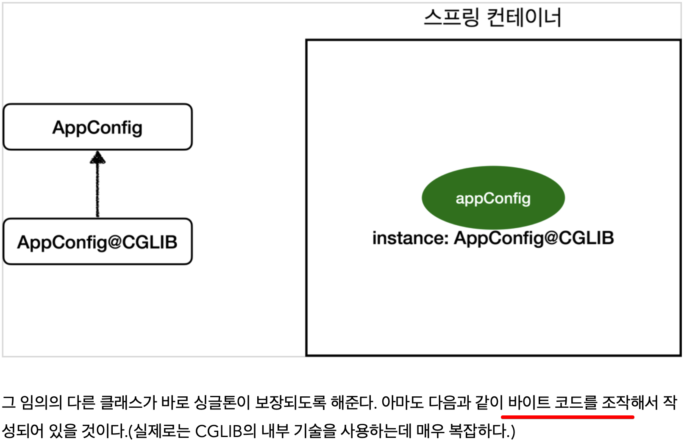

<link href="../md_config/style.css" rel="stylesheet">

# 바이트 코드 조작 싱글톤



<br>

## 1) 구현 방식

- 구현 방식
  - 이미 있는지 확인해서 돌려주는 방식으로 구현됨 -> 있을 경우 있는것으로 돌려주고 없으면 생성해서 돌려줌(기존로직=진짜 java code를)
  - JAVA
    ```JAVA
      @Bean
      public MemberRepository memberRepository() {
        if (memoryMemberRepository가 이미 스프링 컨테이너에 등록되어 있으면?) {
          return 스프링 컨테이너에서 찾아서 반환;
        } else {
          //스프링 컨테이너에 없으면 기존 로직을 호출해서 MemoryMemberRepository를 생성하고 스프링 컨테이너에 등록
          return 반환
        }
      }
    ```

## 스프링 빈 싱글톤 없애기

- 사용하기 위한 전제 조건
  - 원래 사용하듯 CGLIB를 쓰지 않기 위해, @context를 지워주면 활용할 수 있음
  - 문제
    - But 객체가 모두 "매번 생성"되는 단점이 있음 -> 순수한 자바 코드가 실행됨 -> 인스턴스가 매번 새로운 애로 생성되어서 주입되고 사용됨  
      웹 애플리케이션에 맞지 않을 수 있음
    - 주입된 객체가 "Spring Container"의 관리 대상이 아님 -> 직접 new로 작성해서 주입하는 것과 다른 것이 없음
  - 해결
    - @Configuration을 지우고, @Autowired 를 사용
    - Autowired는 자동으로 관계를 주입하는 어노테이션

## 결론

- @Bean만 사용해도 스프링 빈으로 등록되지만, 싱글톤을 보장하지 않음
- memberRepository() 처럼 의존관계 주입이 필요해서 메서드를 직접 호출할 때 싱글톤을 보장하지 않음
- **`크게 고민할 것이 없다. 스프링 설정 정보는 항상 @Configuration 을 사용하여 웹애플리케이션 의도에 맞게 싱글톤으로 사용하면 됨`**
