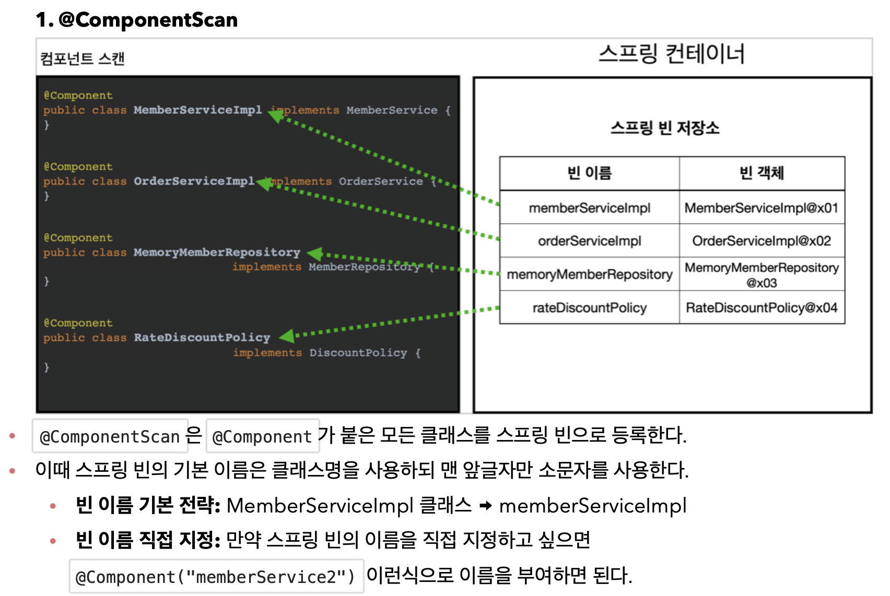

<link href="../md_config/style.css" rel="stylesheet">

# 컴포넌트 스캔 & 의존관계 자동 주입

## 1) 컴포넌트 스캔

- Syntax

  - 설명

    1. 컴포넌트 스캔은 이름 그대로 @Component 애노테이션이 붙은 클래스를 스캔해서 스프링 빈으로 등록
    2. 따라서, @Component 를 붙여주어야 ComponentScan이 제대로 동작함

    <br>

    > 참고: @Configuration 이 컴포넌트 스캔의 대상이 된 이유도  
    > @Configuration 소스코드를 열어보면 @Component 애노테이션이 붙어있기 때문이다.

  - JAVA

    ```JAVA
      import org.springframework.context.annotation.ComponentScan;
      import org.springframework.context.annotation.Configuration;

      @Configuration
      @ComponentScan // 이부분을 사용하므로써 @가 붙은 부분을 알아서 parsing - Scan 함
      public class AutoAppConfig {

      }
    ```

- 원래 Bean 자리에 대체

    <br>

    

    <br>

## 2) 컴포넌트 실사용

1. Component
   - At class level for Beans : 사용하는 애들은 다 Component annotation 붙여주기

<br>

2. Autowired
   - At method level for constructors : **`class의 생성자 주입(생성 메서드)해주는 부분에 적을 것`**

- Example

  - JAVA

    - ac.getBean -> 주입해주는 매서드 이름 적으면 동작 안함(Component Scan은 자바코드 위주로 구현할 것)

      ```JAVA
        public class AutoAppConfigTest {

            @Test
            void basicScan() {
                ApplicationContext ac = new AnnotationConfigApplicationContext(AutoAppConfig.class);
                // 두개 다 사용 가능
        //        AnnotationConfigApplicationContext ac = new AnnotationConfigApplicationContext(AutoAppConfig.class);

                MemberService memberService = ac.getBean(MemberService.class);
                Assertions.assertThat(memberService).isInstanceOf(MemberService.class);
            }
        }
      ```

## 3) 컴포넌트 & 오토와이어드 동작원리

### 1) Component



- 클래스 이름 맨 앞 소문자 되는것에 주의

### 2) Autowired


- 동일 타입을 찾아서 그것을 주입해줌
- 좀더 복잡한 경우, 중복되는 애들이 있거나 하는 경우는 후에 다룸