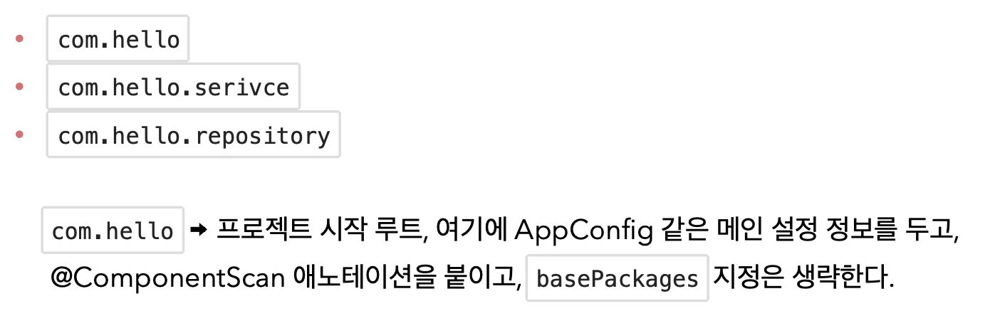

<link href="../md_config/style.css" rel="stylesheet">

# 탬색 위치 지정 & 기본 스캔 대상

## 1) 탐색 위치 지정

- @Configuration - > @ComponentScan 어노테이션 밑에 사용
- basePackages : 탐색할 패키지의 시작 위치를 지정한다. 이 패키지를 포함해서 하위 패키지를 모두 탐색  
  basePackages = {"hello.core", "hello.service"} 이렇게 여러 시작 위치 지정 가능
- basePackageClasses : 지정한 클래스의 패키지를 탐색 시작 위치로 지정
- **`만약 지정하지 않으면 @ComponentScan 이 붙은 설정 정보 클래스의 패키지가 시작 위치`** -> 권장 방법, 기본 방법  
  -> 현재 프로젝트의 최상단에 놓는 것(프로젝트 대표 정보이기 때문에 이게 좋음)

  

## 2) 컴포넌트 스캔 기본 대상

- 컴포넌트 스캔은 @Component 뿐만 아니라 다음과 내용도 추가로 대상에 포함
  1. @Component : 컴포넌트 스캔에서 사용 (2~5번 상세히 들어가면 @compoenet가 다 붙어있음)
  2. @Controlller : 스프링 MVC 컨트롤러에서 사용
  3. @Service : 스프링 비즈니스 로직에서 사용
  4. @Repository : 스프링 데이터 접근 계층에서 사용
  5. @Configuration : 스프링 설정 정보에서 사용
- **`어노테이션 끼리 붙어있는 것은 Java 기능이 아닌, Spring 프레임워크의 기능`**

  - 컴포넌트 스캔의 용도 뿐만 아니라 다음 애노테이션이 있으면 스프링은 부가 기능을 수행
    1. @Controller : 스프링 MVC 컨트롤러로 인식
    2. @Repository : 스프링 데이터 접근 계층으로 인식하고, 데이터 계층의 예외를 스프링 예외로 변환  
       DB를 객체로 취급하는데(DB 프로그램별 접근 인터페이스를 스프링을 통해 일괄로 접근), 오류에 대해서도 같은 취급을 할 수 있게 됨
    3. @Configuration : 앞서 보았듯이 스프링 설정 정보로 인식하고, 스프링 빈이 싱글톤을 유지하도록 추가 처리
    4. @Service : 사실 @Service 는 특별한 처리를 하지 않는다. 대신 개발자들이 핵심 비즈니스 로직이 여기에 있겠구나 라고 비즈니스 계층을 인식하는데 도움
       > 참고: useDefaultFilters 옵션은 기본으로 켜져있는데, 이 옵션을 끄면 기본 스캔 대상들이 제외된다. 그 냥 이런 옵션이 있구나 정도 알고 넘어가자.
