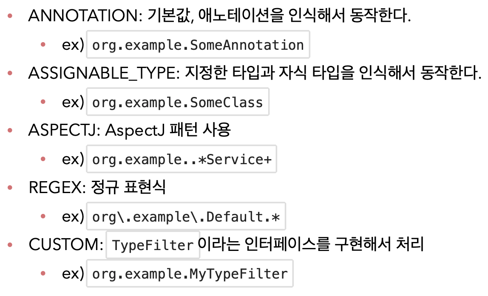

<link href="../md_config/style.css" rel="stylesheet">

# 필터

## 1) Annotation

- 클래스에 메타데이터를 더하는 것
- [Java annotation 참고 링크](https://hamait.tistory.com/314)
- [Java reflection - 동적 로딩 분석 참고 링크](https://madplay.github.io/post/java-reflection)
-

## 2) 필터 지정

<br>



<br>

- 말 그대로 스캔 대상을 추가하거나 제외
- 거의 Annotation 주로 사용(보통 Spring의 기본 default 사용을 권장하므로...)
- 종류

  1. includeFilters
  2. excludeFilters

- Example

  - JAVA

    ```JAVA
      public class ComponentFilterAppConfigTest {

          @Configuration
          @ComponentScan(
                  includeFilters = @Filter(type= FilterType.ANNOTATION, classes= MyIncludeComponent.class),
                  excludeFilters = @Filter(type=FilterType.ANNOTATION, classes = MyExcludeComponent.class)
          )
          static class ComponentFilterAppConfig{

          }

          @Test
          void filterScan() {

              ApplicationContext ac = new AnnotationConfigApplicationContext(ComponentFilterAppConfig.class);
              Assertions.assertThat(ac.getBean(BeanA.class)).isNotNull();
              assertThrows(
                      NoSuchBeanDefinitionException.class,
                      () -> ac.getBean(BeanB.class)
              );
          }
      }
    ```
