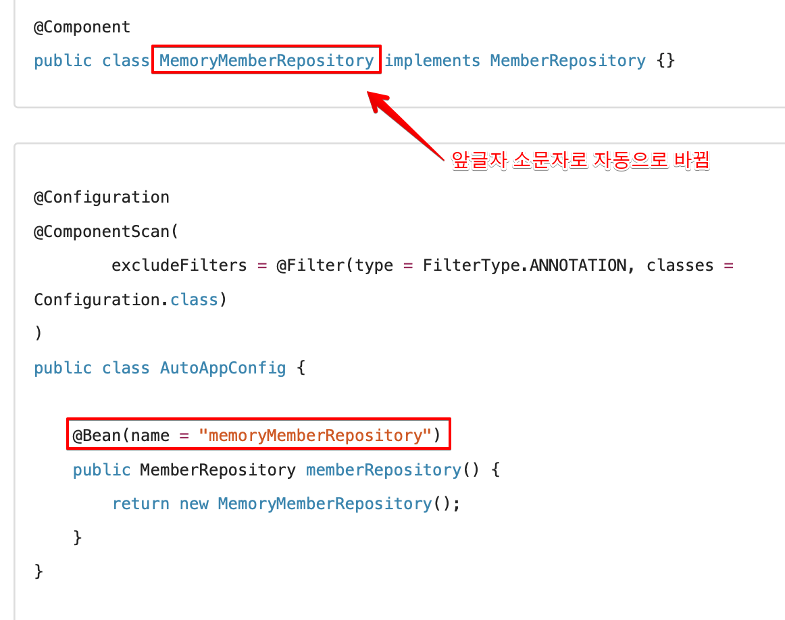

<link href="../md_config/style.css" rel="stylesheet">

# 중복 등록과 충돌



- 같은 빈 이름이 두개일 시 오류 발생
- ConfilictingBeanDefenitionExeption 발생
- 만약 수동등록과 겹친다면? (Autofile에도 정의되어있고, 수동에도 있음)
  - 수동 등록이 우선권; 개발자가 특별히 수정했다고 생각 -> 단, 로그는 잘 표현됨
  - 최근 SpringBoot에서는 오류를 띄우도록 하는 것으로 변했음  
    -> resources/application.properties에 다음을 추가(웬만하면 그냥 안겹치는 이름 쓰기!)

    ```TEXT
      spring.main.allow-bean-definition-overriding=true
    ```
