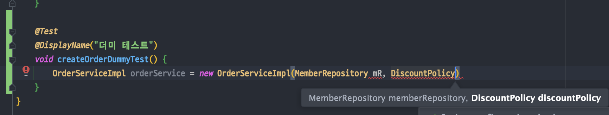

<link href="../md_config/style.css" rel="stylesheet">

# 생성자 주입을 선택하라

## 1) 생성자 주입 선택 이유

- 요즘 트렌드는, 조립시에 모든걸 선택 -> 생성자로 세팅하면, 불변이기 때문에(Impl-service단에서 private final 사용)
- 의도가 조립시에 모두 만든다는 원칙으로 하기 때문
- public으로 인스턴스 변수 / 혹은 set메서드를 제공해버리면 불상사가 일어날 수 있음
- **`순수 자바코드로, 단위테스트시 더미 주입할 때가 있는데, 이때 Spring에 의존하지 않고 테스트 진행할 수 있음`**

  - **`Mock library도 넣어서 dummy 테스트 할 수 있음`**  
    

- Final keyword

  - 생성자 주입을 사용하면, final keywaord를 사용할 수 있음(Constructor 에서 인스턴스 변수에 생성자 할당)
  - Final keyword사용시, 주입 누락을 막을 수 있음 -> 컴파일 시점에 다 막을 수 있음(컴파일 오류가 제일 좋은 오류다!)

    

## 2) 테스트 메서드 - Java 순수 테스트시 더미 주입

- Example

- JAVA

  ```JAVA

    /* 테스트 코드 */
    @Component
    public class OrderServiceImpl implements OrderService{

        private final MemberRepository memberRepository;
        private final DiscountPolicy discountPolicy;

        @Autowired
        public OrderServiceImpl(MemberRepository memberRepository, DiscountPolicy discountPolicy) {
            this.memberRepository = memberRepository;
            this.discountPolicy = discountPolicy;
        }

        @Override
        public Order createOrder(Long memberId, String itemName, int itemPrice) {

            Member member = memberRepository.findById(memberId);

            // 이부분이 분리되어서, 할인은 Discount 쪽에 다 넘겨서 해결
            // 역할의 분리가 잘 되어있음
            int discountPrice = discountPolicy.discount(member, itemPrice);

            return new Order(memberId, itemName, itemPrice, discountPrice);


        }

        // 테스트 용도
        public MemberRepository getMemberRepository() {
            return memberRepository;
        }
    }
  ```

## 2) 무엇을 써야 할까?

- 웬만해서는 생성자 주입 쓰기 - 요즘 DI 프레임워크 대세 + 위에서 본 이유들로 인해
- 수정자 (set/<ValueName> + @Autowired) 도 혼용해서 사용할 수 있음
