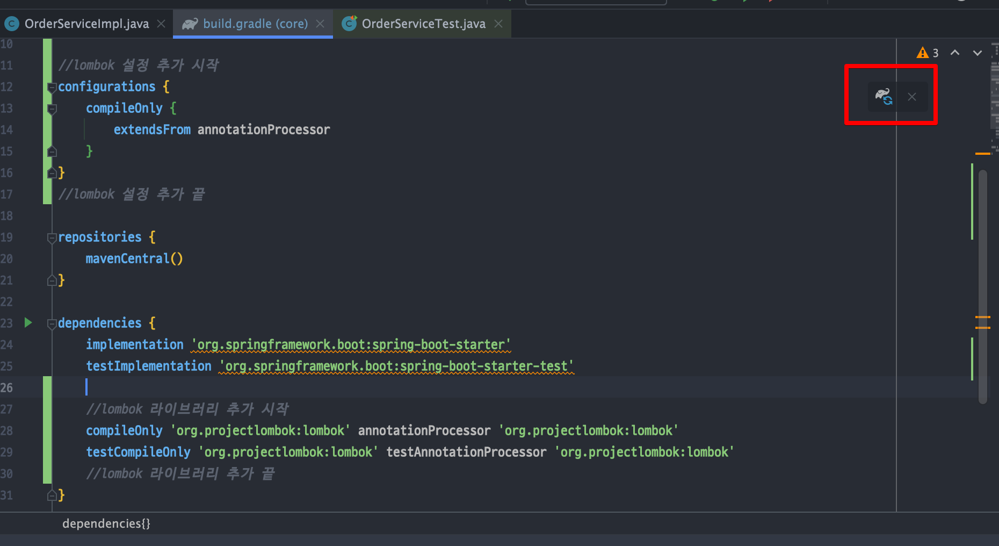

<link href="../md_config/style.css" rel="stylesheet">

# 롬복과 최신 트렌드

## 롬복이란?

- 어노테이션 기반 컴파일시 자주 사용하는 메서드 등을 자동 생성해주는 것
  [롬복 참고 사이트](https://cheershennah.tistory.com/183)

- 설정 ; Spring io 등에서 초기 프로젝트 설정시 사용하면 됨
- 메뉴얼로 수정 완료하였으면 다음과 같이 리프레시 클릭

  

---

## 롬복 트렌드에 맞춰 코드다이어트 하기

### 1) 생성자 생략

- 생성자가 딱 1개만 있으면 @Autowired 를 생략할 수 있음

- JAVA

  ```JAVA
    @Component
    public class OrderServiceImpl implements OrderService {
          private final MemberRepository memberRepository;
          private final DiscountPolicy discountPolicy;

          public OrderServiceImpl(MemberRepository memberRepository, DiscountPolicy discountPolicy) {
              this.memberRepository = memberRepository;
              this.discountPolicy = discountPolicy;
          }
    }
  ```

### 2) 롬복 적용

- 롬복 라이브러리가 제공하는 @RequiredArgsConstructor 기능을 사용하면 final이 붙은 필드를 모아서 생성자를 자동으로 만들어준다.  
  (다음 코드에는 보이지 않지만 실제 호출 가능하다.)

  - JAVA - 예시 1

    ```JAVA
      @Component
      @RequiredArgsConstructor
      public class OrderServiceImpl implements OrderService {
            private final MemberRepository memberRepository;
            private final DiscountPolicy discountPolicy;
      }
    ```

  - JAVA - 예시 2

    ```JAVA
      @Component
      @RequiredArgsConstructor // final 붙은 것 생성자 생성해줌 -> Optional 주입 등에서 생성자 사용하기!
      public class OrderServiceImpl implements OrderService{

          private final MemberRepository memberRepository;
          private final DiscountPolicy discountPolicy;

      //    @Autowired
      //    public OrderServiceImpl(MemberRepository memberRepository, DiscountPolicy discountPolicy) {
      //        this.memberRepository = memberRepository;
      //        this.discountPolicy = discountPolicy;
      //    }
    ```

### 3) 특징

- 최종결과 코드와 이전의 코드는 완전히 동일하다.
- 롬복이 자바의 애노테이션 프로세서라는 기능을 이용해서 컴파일 시점에 생성자 코드를 자동으로 생성해준다.
- 실제 class 를 열어보면 다음 코드가 추가되어 있는 것을 확인할 수 있다.

### 4) 정리

- 최근에는 생성자를 딱 1개 두고, @Autowired 를 생략하는 방법을 주로 사용
- 여기에 Lombok 라이브 러리의 @RequiredArgsConstructor 함께 사용하면 기능은 다 제공하면서, 코드는 깔끔하게 사용할 수 있음!
