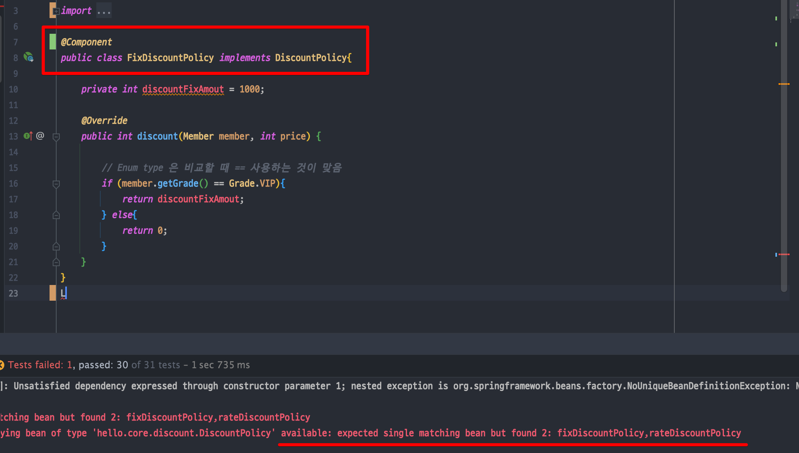
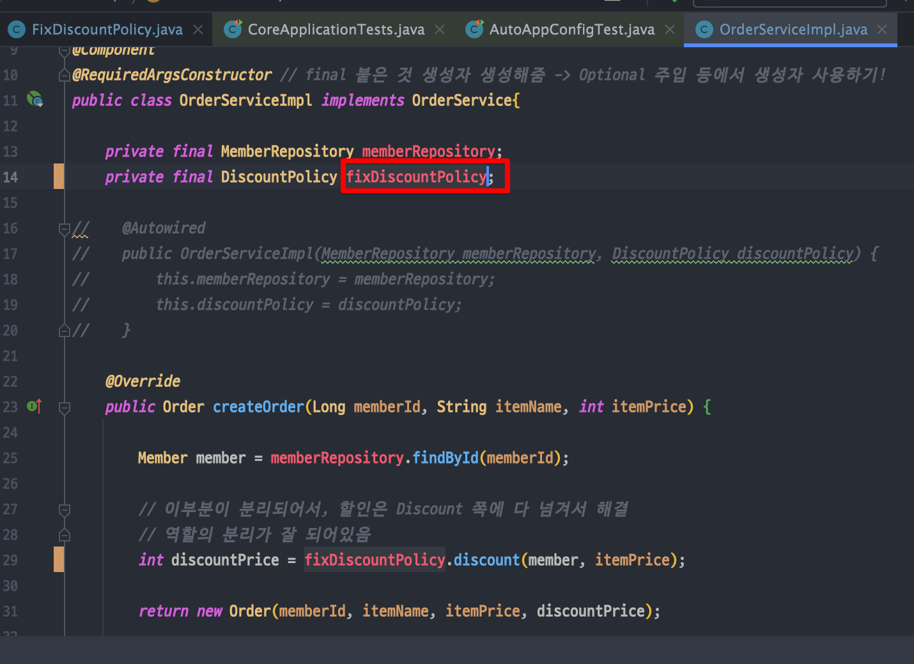
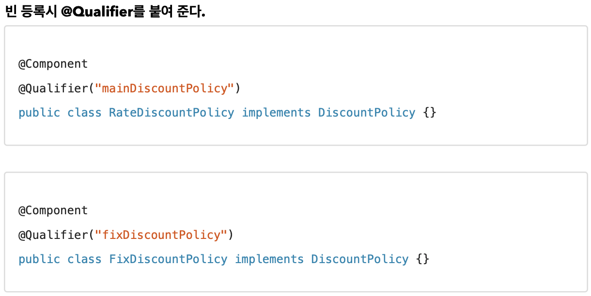
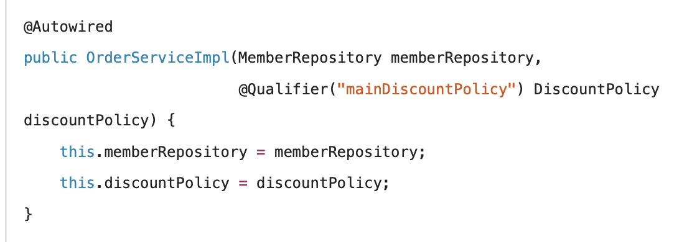

<link href="../md_config/style.css" rel="stylesheet">

# Autowired 조회빈 2개 이상 문제

## 1) Autowired

- 기본적으로 getBean(\<Class name>.class)와 비슷하게 조회
- 타입으로 조회하는 방식(이름 안씀)
- 그렇기 때문에, 타입이 여러개면(2개이상)일 때, 오류가 발생 -> 해결법이 필요함

## 2) 문제 일으키기

- DiscountPolicy 를 두개를 선언
- 즉, Component 를 두개 이상 만들어 같은 타입으로 조회시 2개 이상이 있도록 하는 것

## 3) 해결

- 하위타입으로 지정 -> implemented 된 class로 지정해도 오류는 해결되지만, Dependency Inversion Principle 위배
- @Qualifier, @Primary 로 해결

 

1. @Autowired 필드명 매칭 -> 빈 이름 사용
   - (1) 타입 매칭 이후 실패하면 (2) 파라미터 명으로 빈 이름 매칭
   - 생성자 1개일때, @Autowired 생략가능
   - **`필드명을 ComponentScan시 나타나는 메서드명과 일치시키면 알아서 오류를 피하게 됨`**
   - Example  
     
2. @Qualifier
   - 추가 구분자로 이해할 것 -> 빈 이름을 변경하는 것이 아님!
   - @Qualifier로 운용되는 애들끼리만 사용하는 것이 혼란이 덜할 것
     - 이름을 따로 지정하는 것이기 때문에...!
         
       
3. @Primary
   - 편하고, 자주 사용하는 방식
   - @Primary가 붙은 경우 우선순위를 가지고, 이것이 선택이 됨

## 4) Qualifier VS Primary

- Qualifier

  - 장점 : 여러개 등록 가능
  - 단점 : @Autowired 부분에 일일히 기입해주어야 함

- Primary

  - 장점 : 자동으로 기본값으로 돌아가게 됨

- Qualifier가 더 수동에 가까움으로, 같은 대상에 두개(Primary & Qualifier) 모두 사용하면 Qualifier가 우선권이 있음
