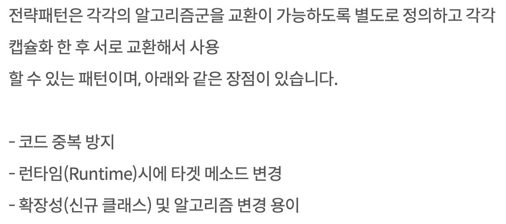
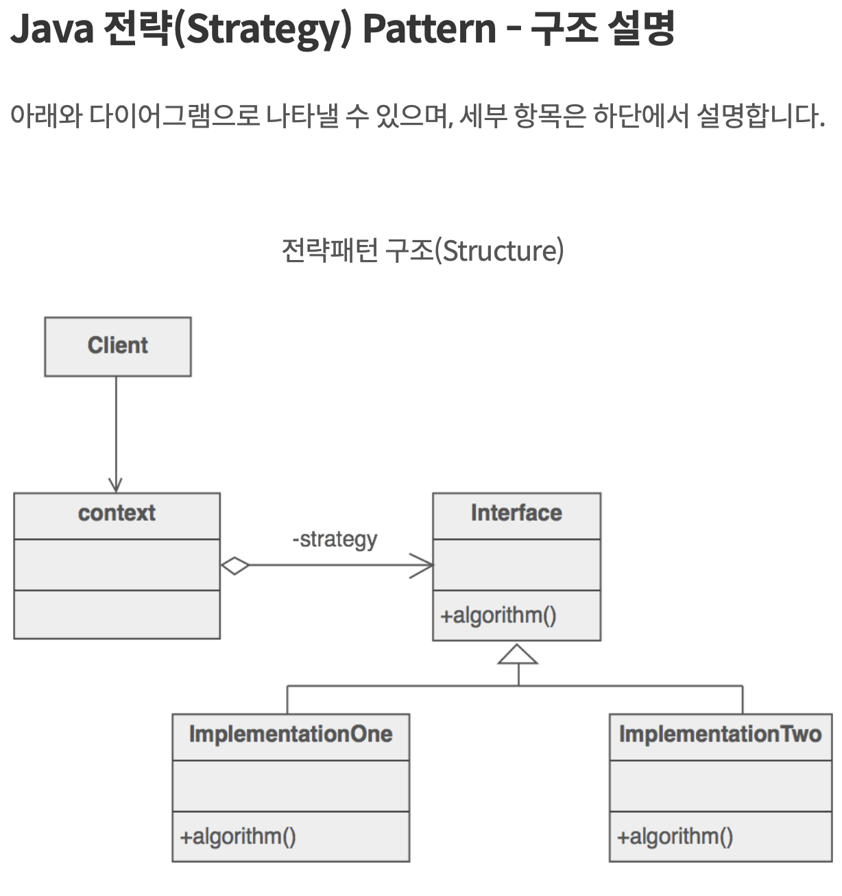
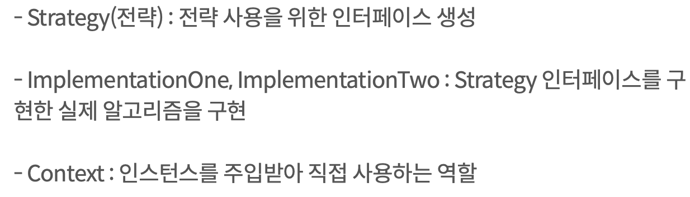

<link href="../md_config/style.css" rel="stylesheet">

# 조회한 빈이 모두 필요할 때

## 1) 필요한 경우

- 할인을 받는 경우, 클라이언트가 만약 할인 방식을 선택할 수 있을 때
- 전략 패턴을 간략하게 구현하는 방식으로 동작
- [참조 링크](https://niceman.tistory.com/133)

  - 요약 : **`같은 interface를 같는 전략을, client 단에서 받아와(예시로-선택할 때), 객체 클라이언트에서 생성자를 주입받아 선택된 전략에 맞춰 매서드 실행하도록 하는 것`**
  - 런타임에 유동적으로 변하는 부분이 분리되어 구현된 것

  

  <br>

    
  

## 2) Syntax

- 설명
  - AnnotationConfigApplicationContext : 여러 컨테이너 등록 가능
  - 예제처럼 DiscountPolicy 를 받으면, 해당하는 스프링 빈을 모두 찾아서 Map, List 에 생성자 주입을 해서 결과를 받아볼 수 있음
- 장점
  - 자동으로 모든 특정 타입을 조회하여 테스트 수행 가능
  - 아마, 모든 해당 타입의 빈을 조회해야하거나, 모두 가져온 후에 테스트 한번에 하고 싶을 때 사용할 수 있는 방식
- Example

  - JAVA

    ```JAVA
      @Test
      void finaAllBean() {

          ApplicationContext ac = new AnnotationConfigApplicationContext(AutoAppConfig.class, DiscountService.class);
      }

      @Configuration
      static class DiscountService {
          private final Map<String, DiscountPolicy> policyMap;
          private final List<DiscountPolicy> polices;

          @Autowired
          public DiscountService(Map<String, DiscountPolicy> policyMap, List<DiscountPolicy> polices) {
              this.policyMap = policyMap;
              this.polices = polices;

              System.out.println("policyMap = " + policyMap);
              System.out.println("polices = " + polices);
          }

      }

      ...


    ```

  - Result - Terminal
    ```TEXT
      policyMap = {fixDiscountPolicy=hello.core.discount.FixDiscountPolicy@7987fb07, rateDiscountPolicy=hello.core.discount.RateDiscountPolicy@62872b47}
      polices = [hello.core.discount.FixDiscountPolicy@7987fb07, hello.core.discount.RateDiscountPolicy@62872b47]
    ```
