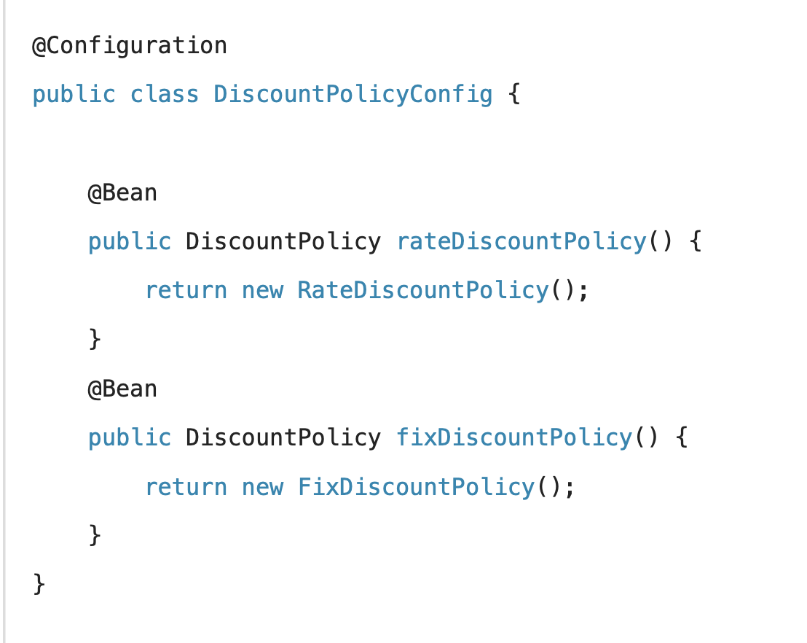
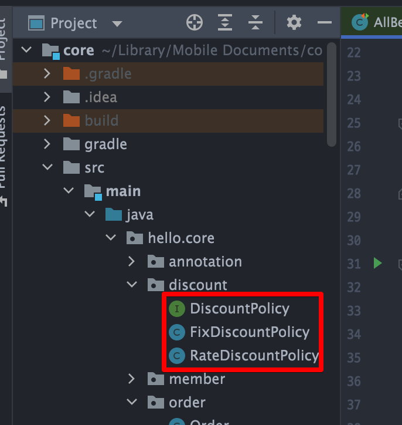

<link href="../md_config/style.css" rel="stylesheet">

# 자동, 수동 올바른 실무의 기준

- 자동을 main으로 사용하자! ; 스프링이 성숙하면서, 자동으로 지원하는 경우가 늘면서 Component scan을 기준으로 깔고 있음
- Component Scan의 @Component 하나만 찍어주면 되는 경우 대비, @Configuration 설정정보에서 일일이 @Bean을 등록하는 것 자체가 부담이 될 수 있음
- **`결정적으로 자동 빈 등록을 사용해도 OCP, DIP를 지킬 수 있음`**

## 1) 수동빈 등록은 언제 사용하나? - Main이 자동이므로

- 어플리케이션; 업무로직 & 기술 지원 로직 으로 나뉠 수 있음
- 업무로직 빈 : 웹을 지원하는 컨트롤러, 핵심 비즈니스 로직이 있는 서비스, 서비스 데이터 계층 로직을 처리하는 리포지토리 등
  - 숫자도 많고, 컨트롤러, 서비스, 리포지토리 등이 유사패턴이 존재함(자동을 쓰면 좋다)
  - 로그가 ide에서 잘 찍히는 등, 어느 범위에서 문제가 발생하였는지 명확하게 파악하기가 쉽다

 

- 기술지원 빈 : 기술적인 문제나 공통관심사(AOP)를 처리할 때 주로 사용; 데이터베이스 연결, 공통 로그 처리 등 업무 처리 로직을 지원하기 위한 하부 기술 / 공통 기술
  - 업무로직 빈에 비해서 그 수가 매우 적음
  - 어플리케이션 전반에 걸쳐서 광범위하게 영향을 끼친다(ex 공통 로그 처리 등)
  - 지원여부 파악이 보통 힘든 경우가 있는데(로그를 다시 사용하는 빈 같은게 없을것이므로 + 광범위하기 때문에 디버깅 등이 어려움)  
    -> 이런 부분에 대해 가급적 수동 빈을 사용해서 명확하게 들어내는 것이 좋음  
    -> Configuration(ex AppConfig)등은 root 레벨에 두면 파악이 쉬운데, 이 위치에 생성하고 수동빈 등록 등이 좋음

## 2) 업무로직 빈에서 수동등록이 좋은 경우

- 비즈니스 로직에서 다형성을 적극 활용할 때

  - 의존관계 자동주입 - 조회한 빈이 모두 필요할 때

     

    

     

  - **`특정 패키지에 같이 묶어두면 파악이 쉽다`**

         
      
      

  - 클래스 다이어그램과 매핑이 되는 코드로, 한눈에 다형성에 따르는 관계를 코드로 확인할 수 있음
  - AutoAppConfig 에서 이 수동 정보를 포함하도록 하고, 사람이 볼때 편리하게 확인할 수 있게 됨
