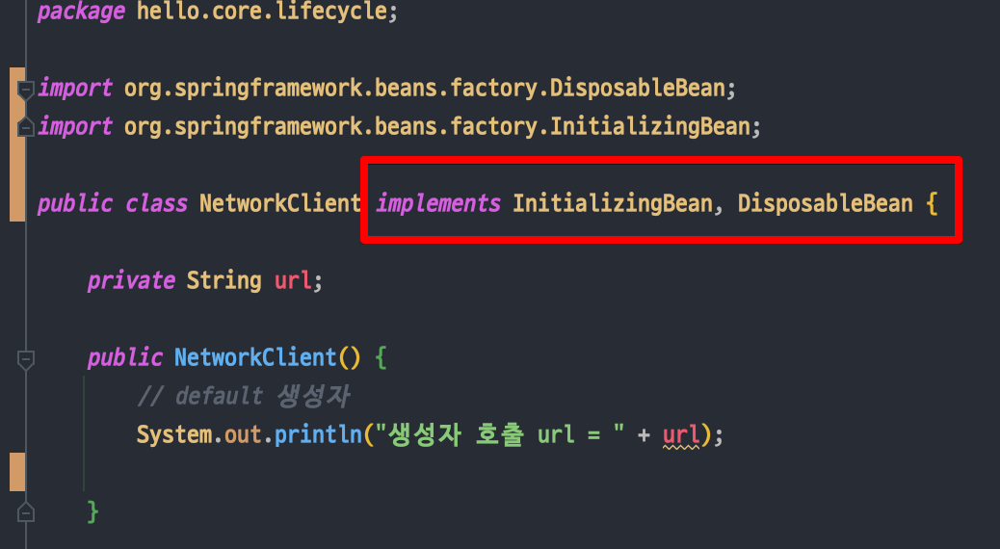

<link href="../md_config/style.css" rel="stylesheet">

# InitializingBean, DisposableBean

## 1) InitializingBean



- 주입 완료 이후 call되는 메서드
- Example

  - JAVA

    ```JAVA

      public class NetworkClient implements InitializingBean, DisposableBean {

          private String url;

          public NetworkClient() {
              // default 생성자
              System.out.println("생성자 호출 url = " + url);

          }

          public void setUrl(String url) {
              this.url = url;
          }

          // 서비스 시작시 호출
          public void connect() {
              System.out.println("connect : " + url); // 실제 붙이지는 않고 호출만 확인
          }

          public void call(String message) {
              System.out.println("call : " + url + " message = " + message);
          }

          // 서비스 종료시 호출
          public void disconnect() {
              System.out.println("close : " + url);
          }

          @Override
          public void afterPropertiesSet() throws Exception {
              // 의존관계 주입이 끝나면 호출해준다는 뜻
              System.out.println("NeworkClient.afterPropertiesSet");
              connect();
              call("초기화 연결 메세지");
          }

          @Override
          public void destroy() throws Exception {
              // 작업 완료 이후, 종료 이전에 수행해야할 것들을 호출해주는 부분
              System.out.println("NetworkClient.destroy");
              disconnect();
          }
      }

    ```

## 2) DisposableBean

- 메서드 수행 완료 이후 종료되는 시점에 call되는 메서드
- Example

  - JAVA

    ```JAVA

      public class NetworkClient implements InitializingBean, DisposableBean {

          private String url;

          public NetworkClient() {
              // default 생성자
              System.out.println("생성자 호출 url = " + url);

          }

          public void setUrl(String url) {
              this.url = url;
          }

          // 서비스 시작시 호출
          public void connect() {
              System.out.println("connect : " + url); // 실제 붙이지는 않고 호출만 확인
          }

          public void call(String message) {
              System.out.println("call : " + url + " message = " + message);
          }

          // 서비스 종료시 호출
          public void disconnect() {
              System.out.println("close : " + url);
          }

          @Override
          public void afterPropertiesSet() throws Exception {
              // 의존관계 주입이 끝나면 호출해준다는 뜻
              System.out.println("NeworkClient.afterPropertiesSet");
              connect();
              call("초기화 연결 메세지");
          }

          @Override
          public void destroy() throws Exception {
              // 작업 완료 이후, 종료 이전에 수행해야할 것들을 호출해주는 부분
              System.out.println("NetworkClient.destroy");
              disconnect();
          }
      }

    ```

## 3) 결과 분석

- JAVA

  ```JAVA

    public class BeanLifeCycleTest {

        @Test
        public void lifeCycleTest() {

            ConfigurableApplicationContext ac = new AnnotationConfigApplicationContext(LifeCycleConfig.class);
            NetworkClient client = ac.getBean(NetworkClient.class);
            ac.close(); // ConfigurableApplicationContext 를 사용해야 사용 가능, AnnotationConfigApplicationContext 보다 상위 context

        }

        @Configuration
        static class LifeCycleConfig {

            @Bean
            public NetworkClient networkClient() {
                NetworkClient networkClient = new NetworkClient();
                networkClient.setUrl("http://hello-spring.dev"); // 모종의 이유로, 객체 생성이후 메서드들이 실행되어야 하는 경우가 있음
                return networkClient;
            }
        }

    }
  ```

- Result Text

  ```TXT
    NeworkClient.afterPropertiesSet
    connect : http://hello-spring.dev
    call : http://hello-spring.dev message = 초기화 연결 메세지
    04:15:19.111 [Test worker] DEBUG org.springframework.context.annotation.AnnotationConfigApplicationContext
       - Closing org.springframework.context.annotation.AnnotationConfigApplicationContext@5362b937, started on Sun Sep 19 04:15:18 KST 2021
    NetworkClient.destroy
    close : http://hello-spring.dev
    BUILD SUCCESSFUL in 3s
    4 actionable tasks: 2 executed, 2 up-to-date
  ```

- 결과 분석

  - Closing org.springframework.context ~~ : 이부분은 ConfigurableApplicationContext + ac.close()에 의해 bean이 소멸하도록 하였으므로 발생

- 장단점
  - 초기화, 소멸 인터페이스 단점
    - 이 인터페이스는 스프링 전용 인터페이스다. 해당 코드가 스프링 전용 인터페이스에 의존한다. 초기화, 소멸 메서드의 이름을 변경할 수 없다.
    - 내가 코드를 고칠 수 없는 외부 라이브러리에 적용할 수 없다.; 해당 라이브러리에 위의 implementation 적용하여야 하는데, 그럴 수 없으므로!
- 참조
  - 인터페이스 사용은 초창기에 사용한 방식이고, 요즘은 거의 사용하지 않음!; 2003.12.08에 나온것
